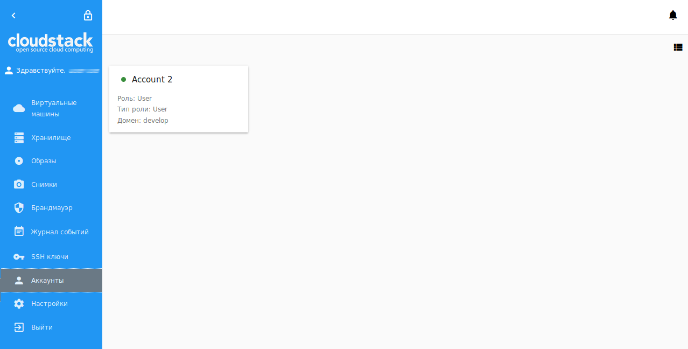
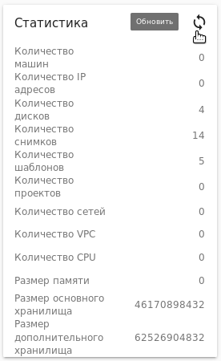
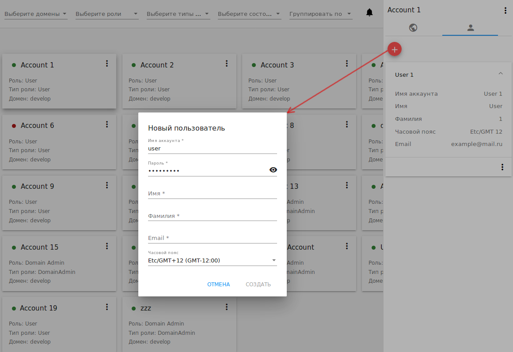
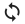

.. _Accounts_RU:

Аккаунты
-----------------
.. Contents::

В разделе *Аккаунты* Администраторы могут управлять аккаунтами и пользователями. Для аккаунтов отображается подробная информация и лимит используемых ресурсов. Обратите внимание, что ресурсы аккаунта делят между собой все пользователи этого аккаунта. При недостатке ресурсов свяжитесь с Администратором. Администратор может изменить лимит ресурсов для аккаунта. Кроме того, он может отслеживать расход ресурсов в аккаунте, т.к. он имеет доступ к статистике ресурсов каждого аккаунта.  

Администраторы видят все аккаунты в домене. Они могут создавать новых пользователей в аккаунте и управлять ими. 

Пользователь может видеть аккаунт, которому он принадлежит, и других пользователей в нем, но не может управлять ими. Для каждого пользователя в аккаунте доступны настройки.  

Список аккаунтов
~~~~~~~~~~~~~~~~~~~~~~~

Раздел "Аккаунты" открывается кликом на *Аккаунты* в навигационной панели слева. В нем представлен список аккаунтов, существующих в домене. Администраторы видят все аккаунты в домене. Пользователь может видеть только свой аккаунт, т.е. аккаунт, которому он принадлежит. 

Отображение аккаунтов можно переключить со списка на карточки, используя переключатель |view icon|/|box icon| справа.

   
Для каждого аккаунта в списке отображается следующая информация:

 - Название аккаунта;
 - Статус - цветовая метка показывает статус аккаунта: зеленая - "Активирован", красная - "Деактивирован"; 
 - Роль - роль аккаунта - Администратор, Администратор ресурсов, Доменный администратор, Пользователь. См. подробнее о ролях в CloudStack в `официальной документации <http://docs.cloudstack.apache.org/projects/cloudstack-administration/en/4.9/accounts.html>`_.
 - Тип роли - тип роли для заданной роли.
 - Домен - домен, которому принадлежит аккаунт.
 - Список действий - позволяет Администратору управлять аккаунтом: деактивировать его или удалить. Подробнее см. раздел :ref:`Account_Action_Box_RU`. 

Фильтрация аккаунтов
"""""""""""""""""""""""""""

Инструмент фильтрации и поиска позволяет быстро найти нужный аккаунт в списке. 

Доступна фильтрация по следующим параметрам:

 - Домены - выберите домен/домены из списка. 
 - Роли - выберите роль из списка -  Администратор, Администратор ресурсов, Доменный администратор и/или Пользователь.
 - Типы ролей - выберите тип/типы ролей из списка.
 - Статусы - выберите статус/статусы из списка - Активирован и/или Деактивирован.

Кроме того, аккаунты можно группировать по параметрам, перечисленным выше.

Создание аккаунта
~~~~~~~~~~~~~~~~~~~~~~~

Создание нового аккаунта в домене доступно для Администратора.

Кликом на "Создать" |create icon| в нижнем правом углу открывается форма создания аккаунта, где необходимо заполнить следующие поля:

.. note:: Обязательные поля отмечены "звездочкой" (*).

- Имя аккаунта * - введите желаемое имя аккаунта, уникальное в домене. 
- Email * - введите email аккаунта.
- Пароль * - введите желаемый пароль. Можно активировать отображение вводимых символов, нажав |view| справа. Спрятать символы вводимого пароля можно кликом на |hide|. 
- Имя * - введите имя первого пользователя аккаунта или другого представителя в аккаунте. Это может быть подразделение или контрагент.
- Фамилия * - введите фамилию пользователя аккаунта или вторую часть названия подразделения или контрагента. 
- Домен * - выберите домен, которому будет принадлежать созданный аккаунт.
- Роль - выберите роль для аккаунта из ниспадающего списка.
- Часовой пояс - укажите часовой пояс, соответствующий местоположению, в котором аккаунт будет действовать.
- Сетевой домен - если сети гостевой машины аккаунта нужно присвоить имя домена, укажите DNS-суффикс. 

Нажмите "Создать", чтобы сохранить новый аккаунт. Он должен появиться в списке аккаунтов. 

Для нового аккаунта пользователь создается автоматически. Имя пользователя соответствует имени и фамилии, указанным в форме при создании аккаунта. Ему присваиваются email и часовой пояс аккаунта.

Информационная панель аккаунта
~~~~~~~~~~~~~~~~~~~~~~~~~~~~~~~~~

Для каждого аккаунта в информационной панели справа представлена информация. Панель открывается кликом на аккаунт в списке:

.. figure:: _static/RU_Accounts_Details.png
   
Информация в ней представлена в двух вкладках: Общее и Пользователи.

Во вкладке *Общее* содержится общая информация по аккаунту: детали, ограничения по ресурсам. 

Ограничения можно редактировать. Право редактирования ограничений есть у Администраторов. Для редактирования ограничений нужно нажать "Редактировать" |edit icon| в блоке ограничений и изменить значения в полях блока. 

   
Также, Администраторы могут видеть статистику использования ресурсов в блоке ниже. Обновить данные статистики можно кликом на |refresh icon|.

Во вкладке *Пользователи* содержится  список пользователей в аккаунте. Для каждого пользователя можно развернуть карточку и увидеть данные: 

 - Имя аккаунта;
 - Имя и фамилия пользователя;
 - Часовой пояс;
 - Email;
 - Секретный ключ - ключ, создаваемый при применении действия "Сгенерировать ключ" из списка действий. Скопировать ключ в буффер обмена можно, кликнув |copy icon|. 
 - Ключ API - ключ, создаваемый при применении действия "Сгенерировать ключ" из списка действий. Скопировать ключ в буффер обмена можно, кликнув |copy icon|.

Для управления пользователем в карточке пользователя доступен список действий. Администратор может управлять всеми пользователями в домене. Пользователь может управлять только своим пользователем. Список действий доступен по клику на |actions icon|. В нем предлагаются следующие действия:

- Изменить пользователя;
- Изменить пароль;
- Сгенерировать ключ;
- Удалить пользователя (доступно для Администратора).

Подробно о действиях с пользователями см. в разделе :ref:`User_Action_Box_RU`.

Создание пользователя
"""""""""""""""""""""""
Администраторы могут создать нового пользователя из вкладки *Пользователи* информационной панели аккаунта. Кликните "Создать" |create icon|: 

В открывшейся форме заполните следующие поля:

.. note:: Обязательные поля отмечены "звездочкой" (*).

- Имя аккаунта * - введите желаемое имя аккаунта, уникальное в домене. 
- Пароль * - введите желаемый пароль. Можно активировать отображение вводимых символов, нажав |view| справа. Спрятать символы вводимого пароля можно кликом на |hide|. 
- Имя * - введите имя пользователя.
- Фамилия * - введите фамилию пользователя.
- Email * - введите email пользователя.
- Часовой пояс * - укажите часовой пояс, соответствующий местоположению, в котором аккаунт будет действовать.

   
Нажмите "СОЗДАТЬ". Новый пользователь будет добавлен в аккаунт. Он появится в списке пользователей данного аккаунта. 

Для отмены создания пользователя нажмите "ОТМЕНИТЬ".

.. _User_Action_Box_RU:

Список действий с пользователем
"""""""""""""""""""""""""""""""""""
Администраторы могут управлять пользователями посредством выбора нужного действия из списка действий для пользователя.  

Список действий позволяет Администратору:

- Изменить пользователя - при выборе данного действия открывается форма редактирования настроек пользователя (имя, email, часовой пояс). Редактируйте информацию и нажмите "СОХРАНИТЬ", чтобы сохранить изменения.

   
- Изменить пароль - при выборе данного действия открывается модальное окно, где следует ввести желаемый пароль в первом поле и подтвердить его в следующем поле. Воспользуйтесь просмотром |view|, чтобы видеть или скрыть символы пароля. Нажмите "СОХРАНИТЬ" для регистрации нового пароля.

   
- Сгенерировать ключ - данное действие позволяет создать или изменить секретный ключ и ключ API для пользователя. Подтвердите свое действие в диалоговом окне, ключи будут сгенерированы/изменены. 
 
- Удалить пользователя - данное действие позволяет удалить пользователя из системы. Подтвердите свое действие в диалоговом окне, и пользователь будет удален. 

.. _Account_Action_Box_RU:

Список действий с аккаунтом
~~~~~~~~~~~~~~~~~~~~~~~~~~~~~

Администраторы могут управлять аккаунтами посредством выбора нужного действия из списка действий для аккаунта под |actions icon|. 

   
Список действий позволяет Администратору:

- Деактивировать аккаунт - доступно для активированных аккаунтов. Позволяет сделать аккаунт неактивным. При деактивации аккаунта облачные ресурсы всех его пользователей будут недоступны, все запущенные машины будут остановлены.  Для деактивации аккаунта нажмите "Деактивировать аккаунт" и подтвердите свое действие в диалоговом окне. Аккаунт будет деактивирован. 

- Активировать аккаунт - доступно для деактивированного аккаунта. Позволяет активировать аккаунт. Для этого нажмите "Активировать аккаунт" и подтвердите свое действие в диалоговом окне. Аккаунт будет активирован. 

- Удалить аккаунт - позволяет удалить аккаунт из системы. Подтвердите свое действие в диалоговом окне, и аккаунт будет удален. 

.. |bell icon| image:: _static/bell_icon.png

.. |view icon| image:: _static/view_list_icon.png
.. |view box icon| image:: _static/box_icon.png
.. |view| image:: _static/view_icon.png
.. |actions icon| image:: _static/actions_icon.png
.. |edit icon| image:: _static/edit_icon.png
.. |box icon| image:: _static/box_icon.png
.. |create icon| image:: _static/create_icon.png
.. |copy icon| image:: _static/copy_icon.png
.. |color picker| image:: _static/color-picker_icon.png
.. |adv icon| image:: _static/adv_icon.png

