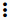

.. _Events_RU:

Журнал событий
-----------------
.. Contents::

В разделе *Журнал событий* отображаются действия пользователя в аккаунте. В списке можно быстро найти события по основным параметрам - дате и ключевым словам. 

Список событий
~~~~~~~~~~~~~~~~
События в Журнале событий отображаются в хронологическом порядке от наиболее позднего до самого раннего. В списке содержатся все события за выбранный день. 

Пользователь видит в журнале только свои действия. Администратор видит события во всех аккаунтах домена.

В списке представлена следующая информация для каждого события:

- Описание события.
- Уровень - категория, которой принадлежит событие. Возможные уровни: 

   - INFO - для простых действий пользователя, например, вход в систему, создание машины, присоединение диска к ВМ. 
   - WARN - для предупреждений.
   - ERROR - для ошибок, например, ошибка при создании SSH ключа. 

- Тип - показывает, в какой части системы имело место данное событие, например: ``USER.LOGIN`` - для событий, произошедших при авторизации пользователя в системе; ``VOLUME.RESIZE`` - для события изменения размера диска. 

- Время события.

Фильтрация событий
"""""""""""""""""""""""""
Фильтрация позволяет быстрее найти в списке нужное событие.  Инструмент фильтрации расположен над списком. 

Фильтровать список можно по следующим параметрам:

- Дата - позволяет выбрать события за определенный день. По умолчанию события отображаются за сегодняшний день. Для выбора даты нажмите |date icon| и в появившемся календаре выберите нужную дату. 

Нажмите "OK" для применения параметров фильтрации. События будут отобраны в соответствии с выбранной датой. 

Чтобы сбросить настройки фильтрации, нажмите "ОТМЕНИТЬ".

- Уровни - позволяет фильтровать события по уровню/уровням. Выберите уровень/уровни из списка. 

- Типы - позволяет отобрать события по типу/типам. Выберите тип/типы из списка.

Администратору доступен дополнительный параметр фильтрации - аккаунты. 

Восользуйтесь поиском, чтобы быстро найти событие в списке по ключевому слову или части слова. 

.. |bell icon| image:: _static/bell_icon.png
.. |refresh icon| image:: _static/refresh_icon.png
.. |view icon| image:: _static/view_list_icon.png
.. |view| image:: _static/view_icon.png

.. |edit icon| image:: _static/edit_icon.png
.. |box icon| image:: _static/box_icon.png
.. |create icon| image:: _static/create_icon.png
.. |copy icon| image:: _static/copy_icon.png
.. |color picker| image:: _static/color-picker_icon.png
.. |adv icon| image:: _static/adv_icon.png
.. |date icon| image:: _static/date_icon.png

