.. _Firewall_RU:

Брандмауэр
--------------
.. Contents::

Раздел *Брандмауэр* содержит шаблоны для создания группы безопасности виртуальной машины, а также разделяемые группы безопасности, используемые виртуальными машинами разных пользователей, и приватные группы безопасности. 

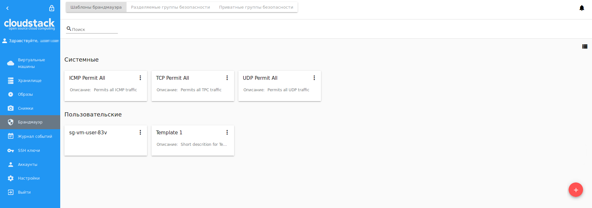

**Шаблоны брандмауэра** представляют собой предзаданные правила безопасности, которые могут быть системными или пользовательскими, созданные отдельными пользователями. Администраторы могут указать в конфигурационном файле JSON те предустановки, которые будут отображаться по умолчанию (см. подробнее в `руководстве по конфигурациям <https://github.com/bwsw/cloudstack-ui/blob/master/config-guide.md>`_). В текущей конфигурации в системе существует три системных шаблона брандмауэра: “TCP Permit All”, “UDP Permit All”, “ICMP Permit All”. Они просто передают весь трафик. Мы предлагаем их пользователям, т.к. хотим, чтобы их машины были доступны, и пользователям для этого не пришлось бы углубляться в технические детали. При необходимость можно создать пользовательский шаблон. Более подробно о создании пользовательского шаблона см. :ref:`Create_FTemplate_RU`.

При создании ВМ система создает новую группу безопасности для данной машины на основе шаблонов. Эта группа изначально включает в себя все правила системных шаблонов, перечисленных выше. Впоследствии, если пользователь редактирует правила для конкретной машины, эти изменения не влияют на работу других машин, а группа становится **приватной** и используется только данной конкретной машиной.   

Также, для виртуальной машины можно использовать **разделяемую группу безопасности**. Разделяемые группы используются несколькими машинами. Изменения правил в них может повлиять на работу других виртуальных машин.

Пользователи могут управлять группами безопасности в двух режимах: в режиме просмотра и в режиме редактирования, переключение между которыми доступно при просмотре правил группы. При редактировании разделяемой группы безопасности система предупреждает, что изменения могут затронуть работу других машин. Это позволяет избежать нежелательных изменений работы других машин. 

Шаблоны брандмауэра, разделяемые и приватные группы безопасности расположены в разных вкладках раздела *Брандмауэр*. Переключаться между шаблонами и разделяемыми или частными группами безопасности можно с помощью кнопок в верхней части экрана.  

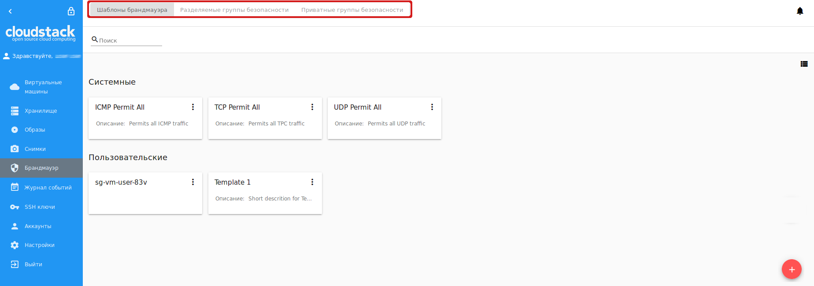

  
Пользователь видит только те группы безопасности, которые принадлежат его/ее пользователю. Администратор видит группы безопасности всех аккаунтов в домене. 

Список групп безопасности
"""""""""""""""""""""""""""

Группы безопасности представлены в виде списка. Формат представления можно изменить на карточки с помощью переключателя |view icon|/|box icon| в правом верхнем углу. 

Для более быстрого поиска группы в списке используйте инструмент поиска сверху. Введите название группы или его часть, и список будет отфильтрован по заданным параметрам. 

Администраторы могут фильтровать список шаблонов/групп безопасности по аккаунтам. 

.. figure:: _static/RU_ Firewall_Filter_Admin.png

.. _Create_FTemplate_RU:

Создание шаблона группы безопасности
""""""""""""""""""""""""""""""""""""""

Вы можете создать собственный шаблон безопасности, который будет доступен при создании виртуальной машины в качестве основы для приватной группы безопасности. 

Новый шаблон группы безопасности создается на основе существующих шаблонов, и он имеет тип "пользовательский" (``custom-template``).

Чтобы создать новый шаблон группы безопасности, нажмите "Создать" |create icon| в правом нижнем углу и заполните поля формы (обязательные поля отмечены "звездочкой" *): 

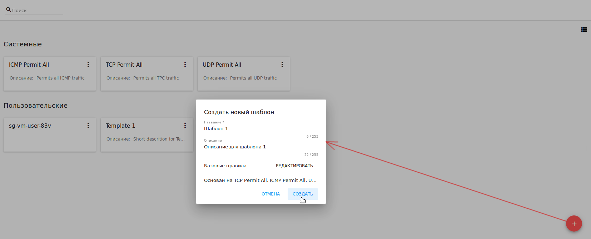

- Название * - введите название шаблона.
- Описание - введите краткое описание шаблона.
- Базовые правила - Нажмите "ДОБАВИТЬ", чтобы открыть список правил для добавления их в шаблон. В появившемся окне выберите шаблон из левого списка "Все шаблоны" и переместите его в правый список "Выбранные шаблоны" с помощью "стрелки":
 
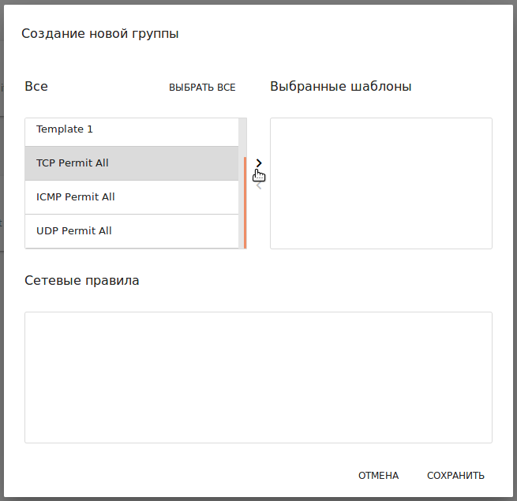

Нажмите “ВЫБРАТЬ ВСЕ”, чтобы разом переместить все шаблоны из левого списка в правый. 

Чтобы очистить список выбранных шаблонов, нажмите “СБРОСИТЬ”. 

В списке ниже появятся правила, соответствующие выбранным шаблонам. Все правила отмечены в списке как активные. Отключите те, которые Вы не хотите добавлять в шаблон брандмауэра. 

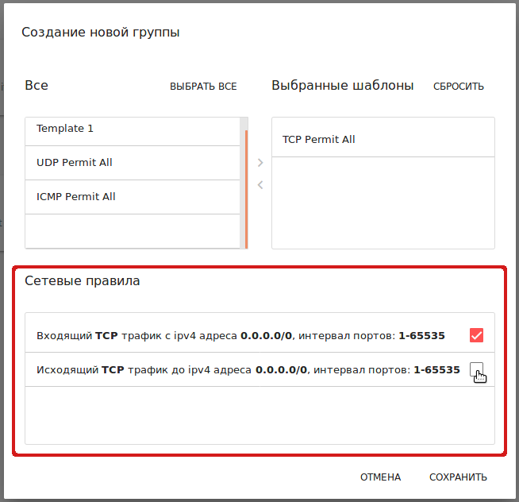

Нажмите “СОХРАНИТЬ” для создания шаблона с выбранными правилами.

Чтобы сбросить выбранные настройки, нажмите “ОТМЕНИТЬ”. Правила не будут добавлены в шаблон. Вы вернетесь к форме создания шаблона. 

Когда все поля заполнены, нажмите "СОЗДАТЬ", чтобы создать новый шаблон брандмауэра. Шаблон появится в списке шаблонов как *Пользовательский*:

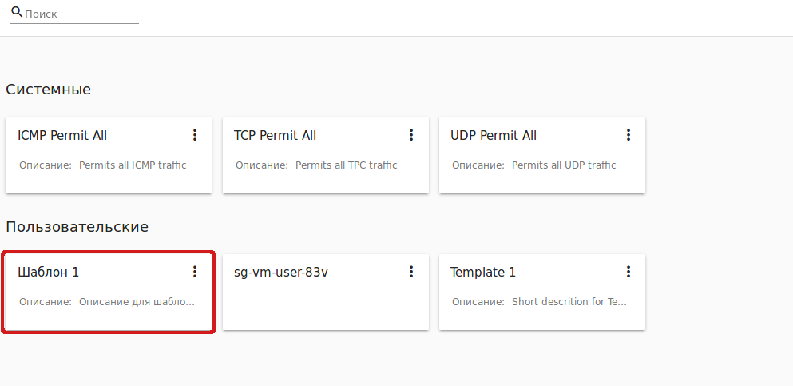
   
Или нажмите "ОТМЕНИТЬ", чтобы отменить создание шаблона. Поля формы будут очищены, новый шаблон не будет создан. 

Создание разделяемой группы безопасности
"""""""""""""""""""""""""""""""""""""""""""
Можно создать разделяемую группу безопасности, которую могут использовать другие пользователи при создании виртуальных машин. 

Новая разделяемая группа безопасности создается на основе существующих шаблонов, и имеет тип "разделяемая" (``shared``).

Чтобы создать новую разделяемую группу безопасности, нажмите "Создать" |create icon| в правом нижнем углу и заполните форму (обязательные поля отмечены "звездочкой" *): 

 - Название * - введите название группы.
 - Описание - введите краткое описание для группы.
 - Базовые правила - нажмите "Добавить", чтобы открыть список доступных правил для добавления в группу. В появившемся окне выберите шаблон из левого списка "Все шаблоны" и переместите его в правый список "Выбранные шаблоны" с помощью "стрелки":
 

   
Нажмите “ВЫБРАТЬ ВСЕ”, чтобы разом переместить все шаблоны из левого списка в правый. 

Чтобы очистить список выбранных шаблонов, нажмите “СБРОСИТЬ”.

В списке ниже появятся правила, соответствующие выбранным шаблонам. Все правила отмечены в списке как активные. Отключите те, которые Вы не хотите добавлять в группу безопасности. 

Нажмите “СОХРАНИТЬ” для создания группы с выбранными правилами.

Или нажмите “ОТМЕНИТЬ”, чтобы сбросить выбранные настройки.  Правила не будут добавлены в группу. Вы вернетесь к форме создания группы безопасности. 

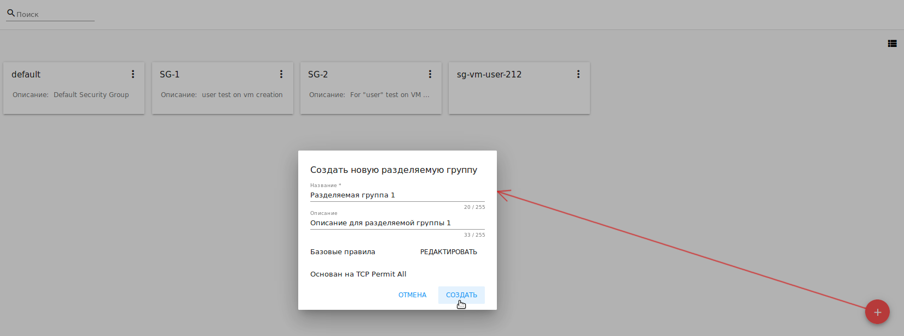
   
Нажмите "СОЗДАТЬ", чтобы сохранить новую группу с выбранными настройками. Группа появится в списке разделяемых групп безопасности. 

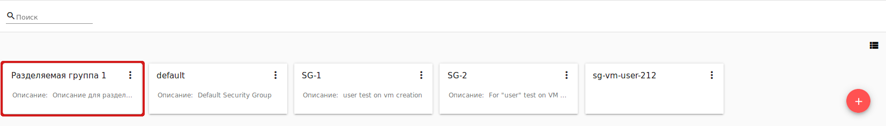

Для отмены создания группы нажмите "ОТМЕНИТЬ". Группа не будет созадана, поля формы очистятся. 

Приватные группы безопасности
"""""""""""""""""""""""""""""""
Существующие в системе приватные группы безопасности отображаются в разделе *Приватные группы безопасности*. 

Создать группу безопасности можно при создании виртуальной машины (см. :ref:`Create_VM`). Название приватной группы имеет следующий формат - ``sg-{{ virtual machine name }}``, - где содержится название виртуальной машины, для которой создана группа. 

Список групп можно фильтровать по названию или его части, используя инструмент поиска над списком.

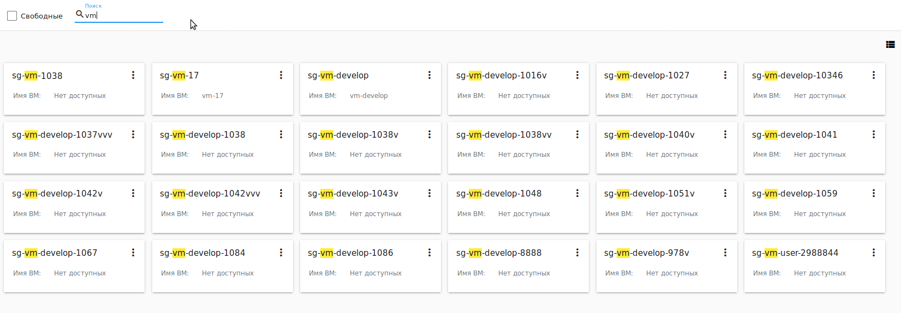

Кроме того, Администратор может фильтровать список по аккаунтам.

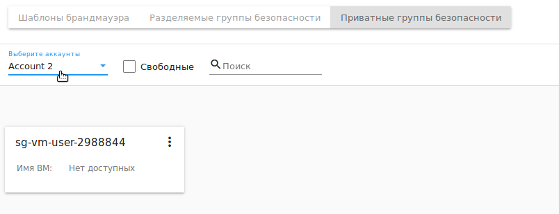

Также, фильтрация списка возможна с помощью опции "Свободные" в левом верхнем углу. Активируйте ее, чтобы отобразить в списке только те группы, которые не используются ни одной виртуальной машиной.

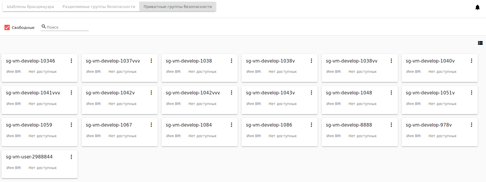

Опция "Свободные" доступна, если в списке групп есть свободные группы безопасности. Свободные группы возникают в случае, когда виртуальная машина была удалена, а группа не удалилась ввиду ошибки или некорректного поведения системы. 

Информационная панель группы безопасности
"""""""""""""""""""""""""""""""""""""""""""
Информацию о группе безопасности можно просмотреть в информационной панели справа. 

Кликните на шаблон/разделяемую группу/приватную группу безопасности в списке и откройте информационную панель справа. В ней расположены две вкладки - Детали и Теги.  

Во вкладке **Детали** отображается следующая информация:

- Название группы безопасности;
- :ref:`SG_Action_Box_RU` под |actions icon|;
- ID группы безопасности;
- Описание группы для общего представления о том, что содержится в группе (для приватных групп описание недоступно);
- Тип - определяет тип группы. Для шаблонов брандмауэра: ``custom-template`` для пользовательских шаблонов, или ``predefined-template`` для системных шаблонов. Для разделяемых групп безопасности: ``shared``. Для приватных групп безопасности: ``private``.

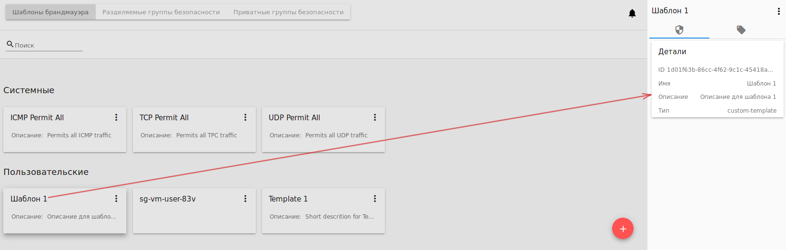
 
Для разделяемых групп безопасности также отображается название машины, для которой используется группа. Название виртуальной машины активно. Кликом на него откроется информационная панель машины. 
 
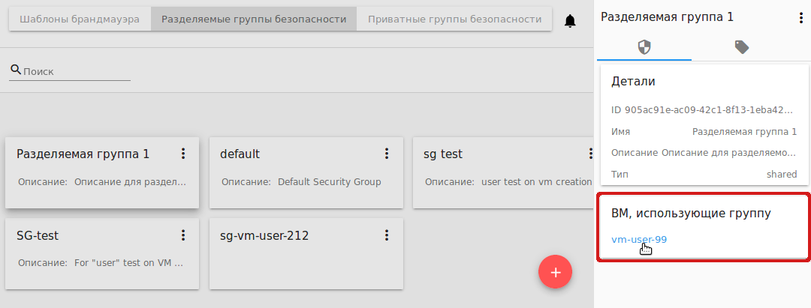

Для приватных групп название машины также отображается в информационной панели, но оно не активно. 

Во вкладке **Теги** представлен список тегов, добавленных к группе безопасности. Используя инструмент поиска над списком, можно быстро найти тег по названию. 

Системные теги отображаются в отдельной карточке.

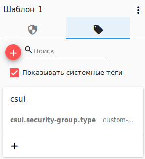

Нажмите |create icon|, чтобы добавить тег. Введите ключ и значение. 

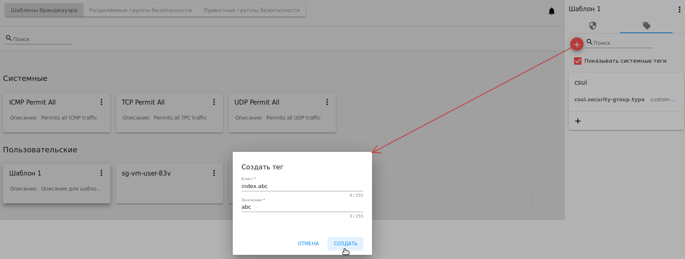

Нажмите "СОЗДАТЬ", чтобы сохранить новый тег. Он отобразится в отдельной карточке.

Созданный тег можно редактировать или удалить, кликнув на соответствующую иконку рядом с названием тега. 

.. _SG_Action_Box_RU:

Список действий с группой безопасности
""""""""""""""""""""""""""""""""""""""""
Для шаблона брандмауэра, разделяемых или приватных групп безопасности можно развернуть Список действий со следующими опциями:

- Правила - позволяет просмотреть правила группы/шаблона. Нажмите "Правила" |view|, чтобы открыть список правил, применяемых для данного шаблона. 

- Удалить - позволяет удалить группу или шаблон из системы. 

.. note:: Нельзя удалить шаблон или группу безопасности, если он/она используется виртуальной машиной, или принадлежит другому пользователю. Также действие удаления недоступно для системных шаблонов брандмауэра. 

Редактирование шаблона брандмауэра/группы безопасности
'''''''''''''''''''''''''''''''''''''''''''''''''''''''''

Кликом на "Правила" |view| в списке действий открывается модальное окно, где представлен список правил шаблона/группы безопасности. Список правил можно фильтровать по:

- Версиям - ipv4 и/или ipv6;
- Типам - Входящее и/или Исходящее;
- Протоколам - TCP и/или UDP и/или ICMP.

Также, список правил можно группировать по типам и/или протоколам.

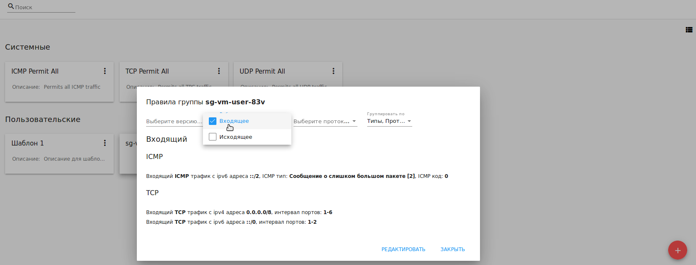

В этом же модальном окне можно редактировать правила. Перейти в режим редактирования можно кликом на  "РЕДАКТИРОВАТЬ" внизу списка. Редактирование подразумевает добавление или удаление правил, отмеченных в списке. 

Для добавления правил заполните поля в панели над списком и нажмите “+”:

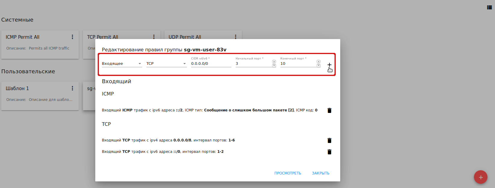
   
Чтобы удалить правила, нажмите на значок удаления. Правило будет удалено из списка. 

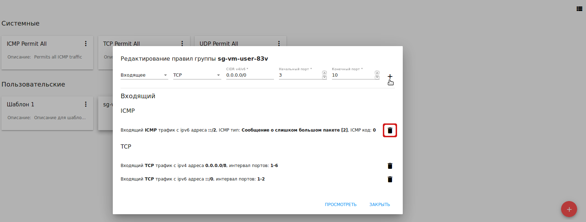
      
Затем можно вернуться в режим просмотра группы или закрыть окно. Измененные правила отобразятся в списке. 

Обаратите внимание, что при редактировании разделяемой группы безопасности, появляется предупреждение:

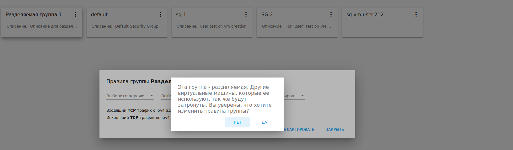

Нажмите “Да”, если группу по прежнему нужно редактировать. Окно переключится в режим редактирования. Измените настройки группы безопасности, как описано выше.

.. note:: Редактирование недоступно для системных шаблонов брандмауэра, а также групп безопасности, принадлежащих другим пользователям. Правила, входящие в них, можно только просматривать.

.. |bell icon| image:: _static/bell_icon.png
.. |refresh icon| image:: _static/refresh_icon.png
.. |view icon| image:: _static/view_list_icon.png
.. |view box icon| image:: _static/box_icon.png
.. |view| image:: _static/view_icon.png
.. |actions icon| image:: _static/actions_icon.png
.. |edit icon| image:: _static/edit_icon.png
.. |box icon| image:: _static/box_icon.png
.. |create icon| image:: _static/create_icon.png
.. |copy icon| image:: _static/copy_icon.png
.. |color picker| image:: _static/color-picker_icon.png
.. |adv icon| image:: _static/adv_icon.png
