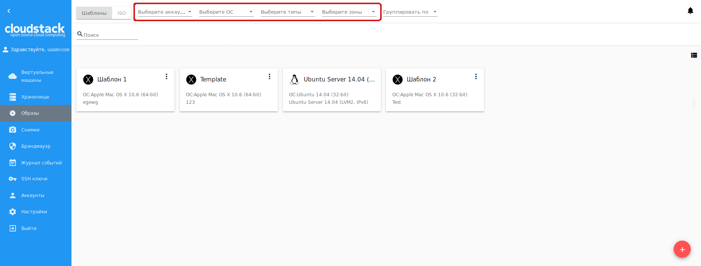

.. _Images_RU:

Образы
---------------
.. Contents::

В разделе *Образы* можно управлять шаблонами и файлами ISO, используемыми с качестве источников установки виртуальных машин.

Шаблон представляет собой повторно используемую конфигурацию для виртуальных машин. При создании машины шаблон выбирается из списка доступных шаблонов в качестве источника установки. Новые шаблоны могут быть созданы и добавлены в список Администраторами или пользователями CloudStack.

Еще одним типом источника установки вляются файлы ISO.

Список можно переключить с шаблонов на ISO, выбрав соответствующую опцию вверху:

Список образов
~~~~~~~~~~~~~~~~~~~~~~~~

Шаблоны/ISO, существующие в системе, представлены в виде списка в разделе "Образы". Пользователь видит только те шаборны/ISO, которые принадлежат его/ее пользователю. Доменный Администратор может видеть шаблоны/ISO всех пользователей в домене, но не может выполнять действия над шаблонами/ISO других пользователей. 

Шаблоны/ISO  могут отображаться в виде списка или карточек. Переключить отображение можно нажатием на |view box icon| в правом верхнем углу. 

Для каждого шаблона/ISO в списке отображается его название, семейство ОС, описание. С помощью кнопки действий |actions icon| можно раскрыть список действий. Список действий доступен только для тех шаблонов/ISO, которые принадлежат пользователю (соответствующие типу "Мои"). Администраторы могут видеть шаблоны/ISO всех пользователей в домене, но не могут управлять теми, что принадлежат другим пользователям. 

Фильтрация образов
""""""""""""""""""""""""""""
Список шаблонов/ISO можно фильтровать по следующим параметрам:

- Аккаунты (для Администраторов);
- Семейства ОС;
- Типы;
- Зоны;
- Группы.

Кроме этого, можно группировать список по зонам и/или группам. Администраторы могут группировать список по аккаунтам.

Используйте инструмент поиска для быстрого поиска нужного шаблона/ISO в списке по его названию или части названия. 

Создание шаблона
~~~~~~~~~~~~~~~~~~~~

Шаблоны можно добавить в систему несколькими способами. В разделе :ref:`VM_Info_RU` упоминался способ создания шаблона из снимка диска виртуальной машины во вкладке "Диски" информационной панели (см. :ref:`Actions_on_Snapshots_RU`). Также, создать шаблон можно на основе снимка диска из информационной панели диска (см. :ref:`Storage_Info_RU`).

Еще одним способом создания нового шаблона является заполнение формы создания шаблона в разделе "Образы". Открыть форму можно нажав "Создать" |create icon| в правом нижнем углу. 

В форме следует заполнить следующие поля:

1. Название * - введите название нового шаблона.

#. Описание * - дайте краткое описание, чтобы иметь общее представление о шаблоне.

#. URL * - введите URL файла шаблона. 

#. Тип ОС * - выберите из ниспадающего списка нужную опцию, или выберите "Другое", если в списке нет нужной опции. 

#. Зона * - выберите зону, в которой шаблон будет доступен.

#. Группа - выберите группу из ниспадающего списка. Список групп управляется Администратором через `конфигурационный файл <https://github.com/bwsw/cloudstack-ui/blob/master/config-guide.md#template-groups>`_. Группа, указанная для шаблона, сохраняется в теги шаблона с тегом ``csui.template.group``. Группу можно редактировать или удалить из вкладки "Шаблон" информационной панели (см. :ref:`Image_Details_RU`) или путем редактирования или удаления тега во вкладке "Теги".

#. Пароль включен - активируйте данную опцию, если для шаблона установлен скрипт изменения пароля CloudStack. Это значит, что доступ к машине, созданной на основе данного шаблона, будет ограничен паролем. Пароль можно будет изменять.

#. Динамическое масштабирование - активируйте данную опцию, если шаблон содержит инструмент XS/VM Ware для поддержки динамического масштабирования CPU/памяти машины.

#. "Показать дополнительные параметры" позволяет развернуть форму и задать следующие настройки:

   - Гипервизор - выберите гипервизор из ниспадающего списка.

   - Формат - формат файла шаблона, например VHD или RAW или VMDK.

   - Извлекаемый - активируйте данную опцию, если шаблон доступен для извлечения. При активации данной опции конечный пользователь может загрузить полный образ шаблона.

   - HVM - активируйте данную опцию для создания шаблона, который требует HVM.

.. note:: Обязательные поля отмечены звездочкой (*).

Заполнив все поля, нажмите "Создать" для сохранения шаблона с заданными настройками. Созданный шаблон появится в списке. 

Или нажмите "Отменить", чтобы закрыть форму без сохранения нового шаблона. Поля формы будут очищены.

Создание ISO
~~~~~~~~~~~~~~~~~~~~

Вы можете создать новый файл ISO в разделе *Образы*, нажав "Создать" |create icon| в правом нижнем углу. 

Откроется форма создания ISO, в которой следует заполнить следующие поля:

1. Название * - введите имя нового файла ISO.

#. Описание * - введите краткое описание, чтобы иметь в дальнейшем общее представление о данном файле ISO.

#. URL * - укажите URL файла ISO. 

#. Тип ОС * - выберите из ниспадающего списка нужную опцию, или выберите "Другое", если в списке нет нужной опции. 

#. Зона * - Выберите зону, в которой будет доступен данный файл ISO.

#. Группа - Выберите группу из ниспадающего списка. Список групп управляется Администратором через `конфигурационный файл <https://github.com/bwsw/cloudstack-ui/blob/master/config-guide.md#template-groups>`_. Группа, указанная для шаблона, сохраняется в теги шаблона с тегом ``csui.template.group``. Группу можно редактировать или удалить из вкладки "Шаблон" информационной панели (см. :ref:`Image_Details_RU`) или путем редактирования или удаления тега во вкладке "Теги".

7. "Показать дополнительные параметры" позволяет развернуть форму и задать следующие настройки:

   - Извлекаемый - активируйте данную опцию, если файл ISO доступен для извлечения. При выборе данной опции конечный пользователь может загрузить полный образ файла ISO.

   - Загружаемый - активируйте данную опцию, чтобы обозначить, что машину, использующую данный ISO, можно загрузить.

.. note:: Обязательные поля отмечены звездочкой (*).

Заполнив все поля, нажмите "Создать" для сохранения файла ISO с заданными настройками. Созданный файл ISO появится в списке. 

Или нажмите "Отменить", чтобы закрыть форму без сохранения нового ISO. Поля формы будут очищены.

.. _Image_Details_RU:

Информационная панель шаблона/ISO 
~~~~~~~~~~~~~~~~~~~~~~~~~~~~~~~~~~~~~~~~~~~~~

Информация по каждому шаблону/ISO представлена в информационной панели справа. Она открывается кликом на шаблон/ISO в списке. Информация представлена в трех вкладках: Шаблон, Зоны, Теги. Вверху над вкладками представлена общая информация о шаблоне/ISO: 

- Название - название шаблона/ISO и символ, 
- Список действий - список действий с шаблоном/ISO, позволяющий удалить шаблон/ISO. 

1. Вкладка "Шаблон"

   Во вкладке "Шаблон" отображается следующая информация: 

   - Описание - описание шаблона/ISO, указанное при его создании. 
   - OС - ОС, выбранная для шаблона/ISO. 
   - Общая информация - настройки, сохраненные для шаблона/ISO: размер, дата создания, тип, гипервизор, другие настройки. 
   - URL - URL, указанная для шаблона/ISO. Рядом расположена кнопка "Копировать" |copy icon|, которая позволяет скопировать URL в буфер обмена и затем вставить ее в адресную строку. 
   - Группа - группа шаблона/ISO. Изменить группу можно, кликнув на "Редактировать" |edit icon|. Выберите одну из существующих групп в списке и нажмите "ПРИСОЕДИНИТЬ". 
   
.. figure:: _static/RU_Images_Temp_Details_GroupEdit.png
   
В этом же окне можно удалить шаблон/ISO из группы. Выберитe "Удалить из группы <название группы>"  и нажмите "УДАЛИТЬ". 

.. figure:: _static/RU_Images_Temp_Details_GroupRemove.png

2. Вкладка "Зоны" 

   Во вкладке "Зоны" отображается зона, в которой доступен шаблон/ISO. Если статус зоны *Готов*, шаблон/ISO можно использовать для создания виртуальной машины.  

3. Вкладка "Теги"  

   Во вкладке "Теги" представлен список тегов шаблона/ISO.

Теги могут быть системными и несистемными. Системные теги обеспечивают дополнительную функциональность с точки зрения пользовательского интерфейса. Изменение этих тегов может затронуть работу всего приложения. Можно включить или выключить отображение системных тегов с помощью опции "Показывать системные теги". При выключении данной опции системные теги будут скрыты из списка, что поможет избежать случайных нежелательных изменений в них. Система запомнит, что отображение системных тегов отключено, и в дальнейшем системные теги не будут отображаться в списке.   

Для шаблонов/ISO используются следующие системные теги:

- ``csui.template.group`` - используется для присвоения группы шаблону/ISO.
- ``csui.template.download-url`` - используется для URL, если она указана для шаблона/ISO.

.. note:: См. полный `список тегов <https://github.com/bwsw/cloudstack-ui/wiki/Tags>`_ , используемых в системе. 

Для быстрого поиска тега в списке воспользуйтесь инструментом поиска вверху. Введите название или часть названия тега, и оно будет выделено в списке.

Для добавления тега к шаблону/ISO нажмите "Создать" |create icon|. В появившейся форме введите:

- Ключ * 
- Значение * 

.. note:: Обязательные поля отмечены звездочкой (*).

Нажмите "СОЗДАТЬ" для добавления нового тега к шаблону/ISO. 

При добавлении системного тега нажмите "+" в карточке. Префикс ``csui`` будет автоматически задан в форме создания тега. 

При создании несистемного тега он будет сохранен в отдельную карточку. При введении ключа в формате ``<prefix>.<example>``, название карточки сохаранится как "<prefix>". Для создания нового тега из данной карточки, нажмите "+" в карточке, и в поле "Ключ" в форме создания будет предзадан указанный <prefix>.

Управление тегами включает в себя редактирование и/или удаление. Наведите мышью на тег в списке и рядом с названием тега появятся кнопки "Редактировать" и "Удалить". 

Нажмите "Редактировать" для изменения ключа или значения тега. Введите изменения в соответствующие поля и сохраните их. 

Нажмите "Удалить" для удаления тега из списка тегов. Подтвердите свое действие в диалоговом окне. Тег будет удален из списка. 

Список действий с шаблоном/ISO 
~~~~~~~~~~~~~~~~~~~~~~~~~~~~~~~

Кликом на "Список действий" |actions icon| раскрывается список действий для данного шаблона/ISO. Список действий доступен только для тех шаблонов/ISO, которые принадлежат пользователю (соответствуют типу "Мои"). 

В списке доступно действие удаления. 

Нажмите "Удалить", чтобы удалить шаблон/ISO. Затем подтвердите свое действие и далоговом окне. Шаблон/ISO будет удален. 

Или нажмите "Отменить". Окно закроется без удаления шаблона/ISO.

.. |bell icon| image:: _static/bell_icon.png
.. |refresh icon| image:: _static/refresh_icon.png
.. |view icon| image:: _static/view_list_icon.png
.. |view box icon| image:: _static/box_icon.png
.. |view| image:: _static/view_icon.png
.. |actions icon| image:: _static/actions_icon.png
.. |edit icon| image:: _static/edit_icon.png
.. |box icon| image:: _static/box_icon.png
.. |create icon| image:: _static/create_icon.png
.. |copy icon| image:: _static/copy_icon.png
.. |color picker| image:: _static/color-picker_icon.png
.. |adv icon| image:: _static/adv_icon.png

