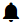

Начало работы с CloudStack-UI
================================
.. Contents::

CloudStack-UI создан для более легкого и удобного управления облачной  инфраструктурой — просмотра и использования облачных ресурсов, включая виртуальные машины, шаблоны и ISO, диски и снимки, группы безопасности и адреса IP.  

Информация, представленная в данном документе, поможет начать работу с CloudStack-UI. Если прежде вы не работали с CloudStack, рекомендуем начать с установки системы CloudStack. Для этого следуйте инструкциям в `официальной документации <http://docs.cloudstack.apache.org/projects/cloudstack-installation/en/4.9/>`_.

Затем установите CloudStack-UI (см. `инструкции по установке интерфейса <https://github.com/bwsw/cloudstack-ui#deployment>`_).

Вход в систему
------------------------

Для входа в систему используйте логин и пароль, предоставленные администратором:

.. note:: Обязательные поля отмечены звездочкой (*).

- Имя пользователя * -  ID пользователя в вашем аккаунте. 
- Пароль * -  Пароль, соответствующий ID пользователя.
- Домен — Укажите домен при входе. CloudStak-UI поддерживает три способа ввода домена. Выберите тот, который для вас более удобен:
  
   1) Введите домен в поле, которое раскрывается нажатием кнопки "Показать дополнительные параметры" |adv icon|.

   2) Администратор может установить домен в конфигурационном файле. В этом случае заданное значение будет автоматически указываться в качестве домена при входе в систему. Пользователю не придется вводить его каждый раз при авторизации. Поле домена можно скрыть нажав на |adv icon|.

   3) Еще одним способом авторизации является вход через URL с указанием в ней домена в следующем формате: ``http://<ip-address>/login?domain=<domain>``.  Значение домена из URL будет автоматически задано в форме авторизации. Примечание: значение домена из URL переопределяет  значение домена, заданного администратором в конфигурационном файле (`см.  подробнее <https://github.com/bwsw/cloudstack-ui/blob/master/config-guide.md#default-domain-url>`_).

Нажмите "Войти" для перехода к CloudStack. Вы увидите первый раздел - *Виртуальные Машины*. 

Слева находится главная навигационную панель. Она позволяет перемещаться от раздела к разделу. Навигационная панель формируется Администратором в конфигурационном файле `см. подробнее <https://github.com/bwsw/cloudstack-ui/blob/master/config-guide.md#sidebar-order>`_ . Администратор может сделать ее редактируемой, т.е. разрешить пользователю менять порядок элементов в главной навигационной панели (кроме раздела *Выход*). (см. `подробнее <https://github.com/bwsw/cloudstack-ui/blob/master/config-guide.md#allow-reordering-sidebar>`_) для получения дополнительной информации об установке настроек навигационной панели).

.. _Resource_Usage_RU:

Используемые ресурсы
--------------------------------------
В этом разделе Вы видите статистику использования ресурсов: используемые и свободные ВМ, вычислительные ресурсы, диски и хранилища. 

Откройте панель *Использование Ресурсов* в верхней части экрана, где представлена информация о следующих ресурсах:

1) Виртуальные машины;
2) Вычислительные ресурсы - CPU, RAM;
3) Диски и их снимки;
4) Хранилище - основное и вторичное.

Вы можете переключиться между используемыми и доступными ресурсами, кликнув переключатель над списком данных о ресурсах.

Пользователь может видеть статистику использования ресурсов только для своего пользователя.

   
Администратор домена может видеть ресурсы для своего аккаунта и для всего домена. 

   
Оповещения о недавних действиях
-------------------------------------------------

В верхнем правом углу экрана можно просматривать список недавних действий, нажав кнопку |bell icon|. Этот список сообщает Вам о последних операциях в системе. Вы можете очистить список после его просмотра, удалив каждое уведомление один за другим, или нажав "ОЧИСТИТЬ" в конце списка для удаления всех оповещений сразу.

    

.. |refresh icon| image:: _static/refresh_icon.png
.. |view icon| image:: _static/view_list_icon.png
.. |view box icon| image:: _static/box_icon.png
.. |view| image:: _static/view_icon.png
.. |actions icon| image:: _static/actions_icon.png
.. |edit icon| image:: _static/edit_icon.png
.. |box icon| image:: _static/box_icon.png
.. |create icon| image:: _static/create_icon.png
.. |copy icon| image:: _static/copy_icon.png
.. |color picker| image:: _static/color-picker_icon.png
.. |adv icon| image:: _static/adv_icon.png

