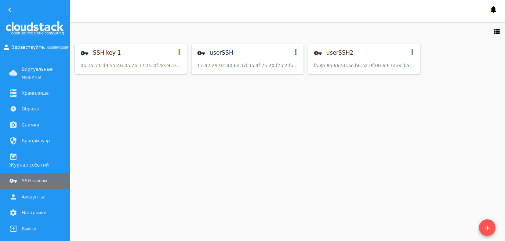
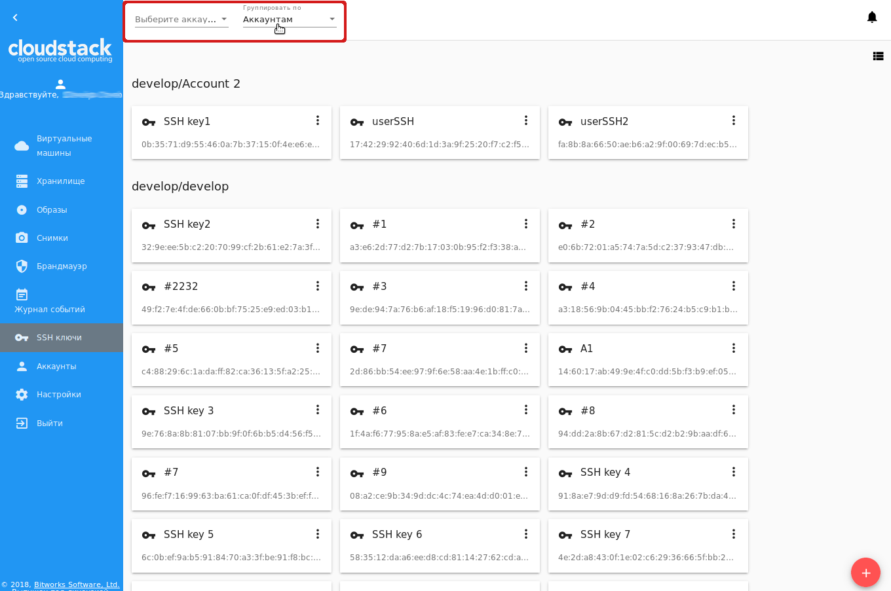
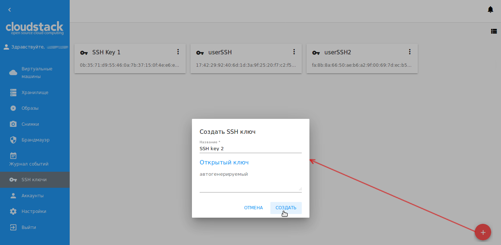
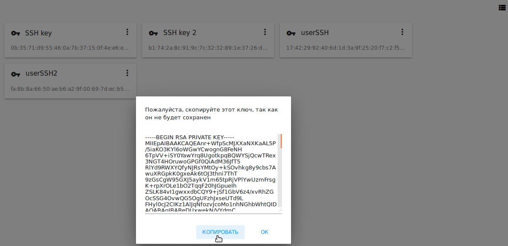
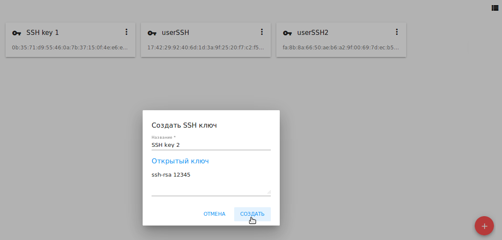
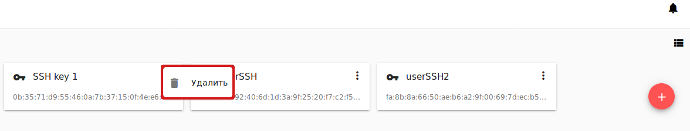

.. _SSH_Keys_RU:

Ключи SSH 
-----------------

.. Contents::

В разделе *Ключи SSH* можно создавать и управлять ключами SSH. 

CloudStack поддерживает использование ключей SSH в качестве дополнительной защиты при доступе к облачной инфраструктуре, помимо имени пользователя и пароля. См.подробнее в `официальной документации <http://docs.cloudstack.apache.org/projects/cloudstack-administration/en/latest/virtual_machines.html?highlight=keys#using-ssh-keys-for-authentication>`_.

CloudStack-UI позволяет управлять ключами SSH в отдельном разделе, что значительно удобнее для пользователя. 

Список ключей SSH 
~~~~~~~~~~~~~~~~~~~

В данном разделе представлены ключи SSH, созданные в аккаунте. Пользователь может просматривать и управлять ключами SSH, которые принадлежат ему.  

Администраторы могут видеть и управлять ключами всех пользователей в домене. 

Существующие ключи могут быть представлены в виде списка или в виде карточек. Используйте переключатель |view icon|/|box icon| в правом верхнем углу.

Для каждого ключа отображается следующая информация:

- Название ключа;  
- Fingerprint открытого ключа SSH;
- Список действий - позволяет удалить ключ из системы.

Фильтрация ключей SSH 
"""""""""""""""""""""""""

Фильтрация ключей доступна для Администраторов и позволяет фильтровать и группировать ключи по аккаунтам. 

Панель фильтрации расположена над списком ключей.

Создание ключа SSH
~~~~~~~~~~~~~~~~~~~

Чтобы создать новый ключ SSH для аутентификации, нажмите "Создать" |create icon| в правом нижнем углу и в открывшейся форме введите назавание ключа: 

Ключ может быть:

1. сгенерирован автоматически, или

2. задан пользователем.

**Автоматическая генерация ключа**

Для автоматической генерации ключа нажмите “СОЗДАТЬ” в в форме создания, после того, как задано название ключа. Ключ SSH будет сгенерирован автоматически. В модальном окне появится закрытый ключ, который нужно будет скопировать и сохранить локально. В системе он не сохранится. Нажмите "КОПИРОВАТЬ", чтобы правильно скопировать его в буфер обмена и сохранить себе. 

Нажмите “OK”, чтобы закрыть окно. Открытый ключ появится в списке ключей SSH, для него будет отображаться fingerprint.

**Создание ключа, заданного пользователем**

Чтобы задать значение для ключа, введите значение ключа во втором поле, после того, как ввели название. Значение ключа должно начинаться с ``ssh-rsa`` с последующим пробелом и минимум одним символом после него. Затем нажмите “СОЗДАТЬ”. 

Ключ будет сохранен. Закрытый ключ в данном случае не будет создан.

Новый ключ будет доступен для добавления к виртуальной машине сразу после создания. 

Информационная панель ключа SSH
~~~~~~~~~~~~~~~~~~~~~~~~~~~~~~~~~~~~

Кликом на ключ SSH в списке можно открыть информационную панель справа.

.. figure:: _static/RU_SSH_Details1.png

В ней отображается следующая информация:

- Название ключа SSH;
- Список действий, через который можно удалить ключ;
- Fingerprint открытого ключа SSH;
- Описание ключа SSH - В данном блоке можно добавить описание для ключа, для лучшего понимания его назначения. Кликните на блок и введите описание в текстовое поле. Нажмите "СОХРАНИТЬ".  

.. figure:: _static/RU_SSH_Details_EditDescr.png

Для отмены добавления описания нажмите "ОТМЕНИТЬ".

Описание ключа можно редактировать, кликнув на |edit icon|. Измените описание ключа в текстовом поле и сохраните изменения.

Описание ключа сохраняется в теги аккаунта, если они активированы. Активировать теги аккаунта может Администратор, задав настройки в `конфигурационном файле <https://github.com/bwsw/cloudstack-ui/blob/master/config-guide.md>`_.

Список действий с ключом SSH
~~~~~~~~~~~~~~~~~~~~~~~~~~~~~~~~~~

Список действий для ключей SSH открывается кликом на |actions icon| напротив нужного ключа в списке. Список действий доступен для тех ключей, которые принадлежат пользователю.

В списке действий доступно действие удаления ключа SSH.

Нажмите "Удалить" в списке и подтвердите свое действие в диалоговом окне. Ключ будет удален.

Для отмены удаления ключа нажмите "Отменить". Модальное окно закроется, ключ не будет удален из системы.

.. |bell icon| image:: _static/bell_icon.png
.. |refresh icon| image:: _static/refresh_icon.png
.. |view icon| image:: _static/view_list_icon.png
.. |view| image:: _static/view_icon.png
.. |actions icon| image:: _static/actions_icon.png
.. |edit icon| image:: _static/edit_icon.png
.. |box icon| image:: _static/box_icon.png
.. |create icon| image:: _static/create_icon.png
.. |copy icon| image:: _static/copy_icon.png
.. |color picker| image:: _static/color-picker_icon.png
.. |adv icon| image:: _static/adv_icon.png

