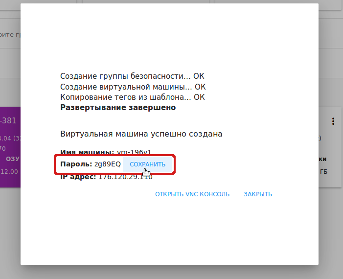

.. _Settings_RU:

Настройки
-------------
.. Contents::

В разделе *Настройки* пользователь может вносить изменения в интерфейс, редактируя настройки. 

Безопасность
~~~~~~~~~~~~~~~~~~
Пользователь может управлять следующими настройками безопасности:

- Изменение пароля;
- Лимит времени сеанса;
- Опция "Сохранять пароли ВМ по умолчанию".

Изменение пароля
""""""""""""""""""
В данной секции можно изменить пароль, предоставленный Администратором, на желаемый пароль, что может улучшить безопасность аккаунта.

Введите новый пароль и подтвердите его во втором поле:

Нажмите "ОБНОВИТЬ" и сохраните новый пароль.

Если вы забыли или потеряли пароль, обратитесь к Администратору.

Лимит времени сеанса
"""""""""""""""""""""

В данной секции можно установить максимальное количество времени в минутах, в течение которого сессия будет оставаться активной в отсутствие действий пользователя. По истечение установленного времени сессия будет автоматически завершена. По умолчанию установлен интервал 30 минут.

Установите желаемый лимит вермени в минутах, используя  переключатель |switch icon| справа или посредством ввода значения в поле. Затем нажмите "ОБНОВИТЬ", чтобы сохранить изменения.

Установленное значение сохраняется в теги пользователя.

Максимальное разрешенное значение - 300 минут. Обратите внимание, что более длительный период сессии снижает безопасность аккаунта. 

Лимит времени сеанса можно установить в конфигурационном файле. См. подробнее в `руководстве по конфигурациям <https://github.com/bwsw/cloudstack-ui/blob/master/config-guide.md#session-timeout>`_.

Сохранять пароли ВМ по умолчанию
""""""""""""""""""""""""""""""""""
Данная опция позволяет автоматическ сохранять пароли в теги ВМ при создании машин, для которых необходимы пароли.  

Активируйте опцию в данной секции. При создании машины пароли сразу будут сохранятся в теги ВМ. В диалоговом окне создания ВМ пароль (если он требуется для данной ВМ) будет отмечен как сохраненный:

Если данная опция не активирована, каждый раз при создании ВМ система будет спрашивать о необходимости сохранить пароль, нажав "СОХРАНИТЬ" рядом с паролем:

Затем система спросит, нужно ли автоматически сохранять пароли ВМ. Кликнув "Да", Вы активируете опцию "Сохранять пароли ВМ по умолчанию"в разделе "Настройки". См.подробнее о создании ВМ в разделе :ref:`Create_VM_RU`.

Конфигурация API
~~~~~~~~~~~~~~~~~~~~

В данном блоке настроек можно просматривать и управлять настройками API: регенерерировать ключи API, просматривать URL подключения.

Ключ API и Секретный ключ отображаются в соответствующих полях. Их можно скопировать нажатием на |copy icon| справа. 

Для регенерации ключей нажмите |refresh icon| вверху блока. В соответствующих полях появятся новые ключи.

В поле ниже отображается URL подключения, используемая для отправки запросов в CloudStack API. С полным перечнем используемых запросов можно ознакомиться в официальной документации Apache CloudStack, доступной по предоставленной ссылке.

Настройки интерфейса
~~~~~~~~~~~~~~~~~~~~~~
В данном блоке настроек можно изменить параметры интерфейса. 

Язык интерфейса
"""""""""""""""""""
Выберите язык интерфейса из представленных в списке вариантов: русский или английский.

Первый день недели
"""""""""""""""""""
В данном блоке можно выбрать один из типов недели: воскресенье - суббота или понедельник - воскресенье. 

Выберите из ниспадающего списка день, с которого будет начинаться неделя: понедельник или воскресенье. 

.. The first day of week can be set in the configuration JSON file. You will find more information in the `Config Guide <https://github.com/bwsw/cloudstack-ui/blob/master/config-guide.md>`_. 

Формат времени
""""""""""""""""
В данном блоке можно переключить формат времени с 12-часового на 24-часовой. 
При выборе варианта "Автоматически"  формат времени будет установлен в зависимости от выбранного языка интерфейса: 

- если язык интерфейса английский - 12-часовой формат;

- если язык интерфейса русский - 24-часовой формат. 

.. The time format can be set in the configuration JSON file. You will find more information in the `Config Guide <https://github.com/bwsw/cloudstack-ui/blob/master/config-guide.md>`_. 

Цвет темы
"""""""""""""""""""
Выберите желаемый цвет темы. В текущей реализации доступны два варианта: сине-красный или индиго-розовый. Сине-красный цвет темы используется по умолчанию. 

Кликните на поле и выберите желаемый цвет.

Цвет темы можно установить в конфигурационном файле JSON. См.подробнее в `руководстве по конфигурациям <https://github.com/bwsw/cloudstack-ui/blob/master/config-guide.md#default-theme-name>`_. 

.. |bell icon| image:: _static/bell_icon.png
.. |refresh icon| image:: _static/refresh_icon.png
.. |view icon| image:: _static/view_list_icon.png
.. |view box icon| image:: _static/box_icon.png
.. |view| image:: _static/view_icon.png
.. |actions icon| image:: _static/actions_icon.png
.. |edit icon| image:: _static/edit_icon.png
.. |box icon| image:: _static/box_icon.png
.. |create icon| image:: _static/create_icon.png
.. |copy icon| image:: _static/copy_icon.png
.. |color picker| image:: _static/color-picker_icon.png
.. |adv icon| image:: _static/adv_icon.png
.. |switch icon| image:: _static/switch_icon.png

