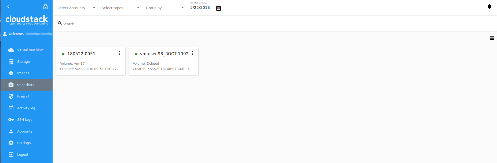
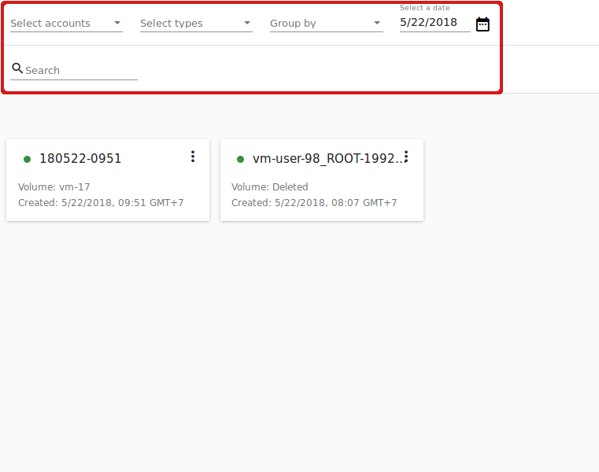
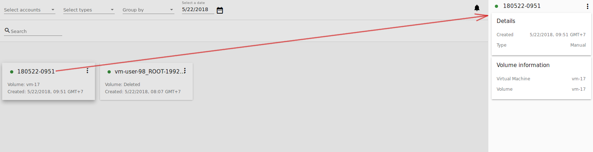
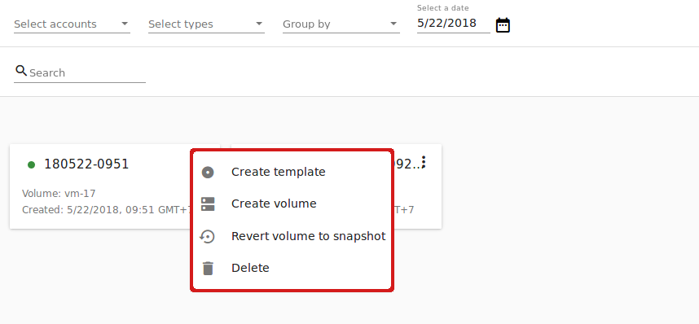
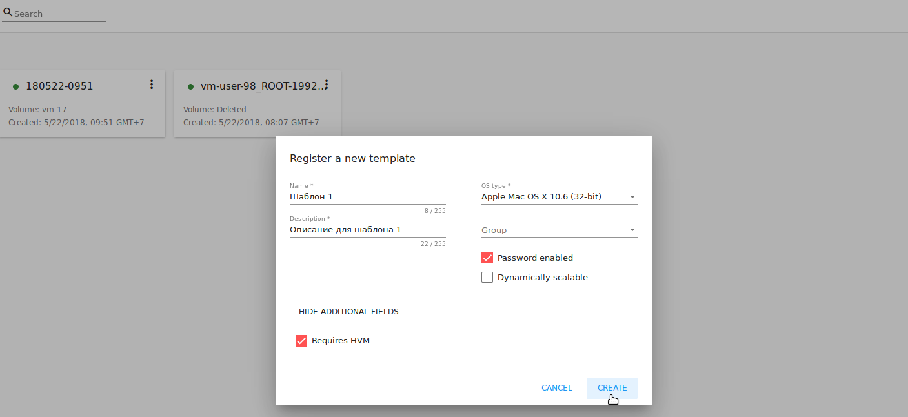
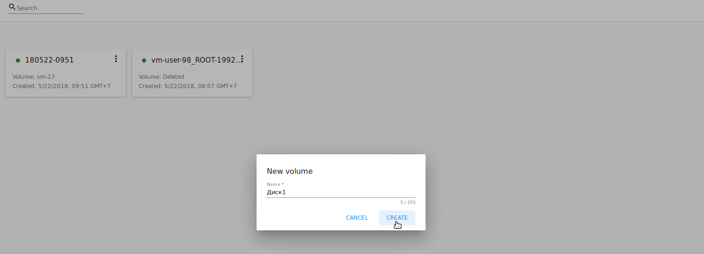
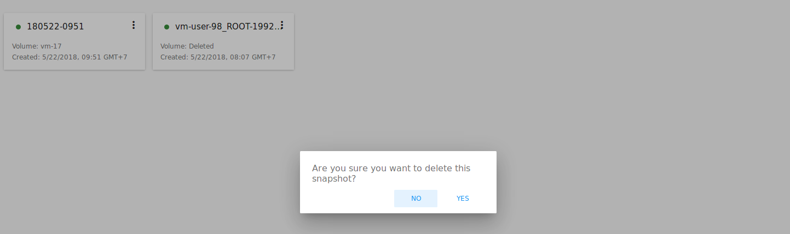

Снимки
=============
.. Contents::

В разделе *Снимки* содержится информация о снимках, существующих в системе. 

Список снимков
-------------------
Снимки могут быть представлены в формате карточек или в формате списка. Менять представление можно с помощью переключателя |view icon|/|box icon| в правом углу списка.

Фильтрация снимков
~~~~~~~~~~~~~~~~~~~~~~~~~~~~
Инструмент фильтрации снимков доступен вверху списка. 

Фильтровать список можно по следующим параметрам:

- по аккаунтам (доступно для Администраторов);
- по типу - ежечасные, ежедневные, еженедельные, ежемесячные, с ручным режимом создания снимков, в зависимости от расписания создания снимков.
- по дате создания - выберите дату с помощью календаря, чтобы видеть в списке снимки, сделанные в этот день.

Список снимков также можно группировать по аккаунтам (доступно для Администраторов) и/или по типу. 

С помощью инструмента поиска можно быстро найти снимок в списке по:

- названию или части названия;
- описанию снимка.

Для каждого снимка в списке представлена следующая информация:

- Метка статуса - зеленая - снимок сохранен, красная - ошибка, желтая - снимок создается, серая - снимок аллоцирован. 
- Название снимка.
- Диск, с которого создан снимок. 
- Дата и время создания снимка.
- Список действий |actions icon|.

Информационная панель снимка
-----------------------------------
В информационной панели отображается информация о снимке. Панель открывается справа, кликнув на снимок в списке. 

В информационной панели отображаются следующие данные:

- Дата и время создания снимка;
- Тип - тип снимка;
- Информация о диске и виртуальной машине, к которой относится снимок. 

Список действий со снимком
-----------------------------------
Для снимка доступны следующие действия:

- Создать шаблон;
- Создать диск;
- Вернуть диск к состоянию снимка;
- Удалить. 

Ниже каждое действие описано подробнее.

**Создат шаблон**

Откройте форму создания шаблона из снимка.

Заполните поля:

- Название * - введите название нового шаблона.
- Описание * - дайте краткое описание для шаблона.
- Тип ОС * - выберите тип ОС из ниспадающего списка.
- Группа - выберите группу из ниспадающего списка.
- Пароль включен - отметьте эту опцию галочкой, если у вашего шаблона установлен скрипт изменения пароля CloudStack. То есть, машина, созданная на основе данного шаблона, будет доступна по паролю, и пароль можно изменить.
- Динамическое масштабирование - отметьте эту опцию галочкой, если ваш шаблон содержит инструмент XS/VM Ware для поддержки динамического масштабирования CPU/памяти ВМ.

.. note:: Обязательные поля отмечены звездочкой (*).

Нажмите «Показать дополнительные параметры», чтобы развернуть список дополнительных параметров настройки. Откроется флажок HVM. Он позволяет создать шаблон, который требует HVM. Отметьте эту опцию при необходимости.

Как только все поля заполнены, нажмите «СОЗДАТЬ», чтобы создать новый шаблон.

Чтобы отменить создание шаблона, нажмите "ОТМЕНИТЬ".

**Создание диска**

Данное действие позволяет создать диск из снимка.

В открывшемся окне введите название диска в поле "Название". Нажмите "СОЗДАТЬ", чтобы сохранить новый диск. 

Чтобы отменить создание диска, нажмите "ОТМЕНИТЬ".

**Вернуть диск к снимку**

С помощью данного действия можно вернуть состояние диска к снимку. Оно доступно для тех снимков, у которых есть диск. 

В диалоговом окне подтвердите ваше действие. Обратите внимание, что виртуальная машина, к которой относится диск, будет переустановлена. 

.. figure:: _static/RU_Snapshots_Actions_Revert.png

**Удалить**

Данное действие позволяет удалить снимок из системы.

Нажмите "Удалить" в списке действия и подтвердите свое действие в появившемся окне. Снимок будет удален.  

Чтобы отменить удаление снимка, нажмите "ОТМЕНИТЬ".

.. |bell icon| image:: _static/bell_icon.png
.. |refresh icon| image:: _static/refresh_icon.png
.. |view icon| image:: _static/view_list_icon.png
.. |view box icon| image:: _static/box_icon.png
.. |view| image:: _static/view_icon.png
.. |actions icon| image:: _static/actions_icon.png
.. |edit icon| image:: _static/edit_icon.png
.. |box icon| image:: _static/box_icon.png
.. |create icon| image:: _static/create_icon.png
.. |copy icon| image:: _static/copy_icon.png
.. |color picker| image:: _static/color-picker_icon.png
.. |adv icon| image:: _static/adv_icon.png
