.. _Storage_RU:

Хранилище
--------------------------

В данном разделе можно создавать дополнительные диски для виртуальных машин и управлять ими.

Список дисков
~~~~~~~~~~~~

.. note:: В начале работы в CloudStack у Вас нет виртуальных машин и дисков. При создании виртуальной машины для нее автоматически создается корневой диск. Создание дополнительных дисков отнимает ресурсы и требует дополнительных затрат. Прежде, чем создавать дополнительный диск, пожалуйста, убедитесь, что он Вам действительно необходим.

Существующие диски представлены в разделе в виде списка. Пользователю доступны только его диски.

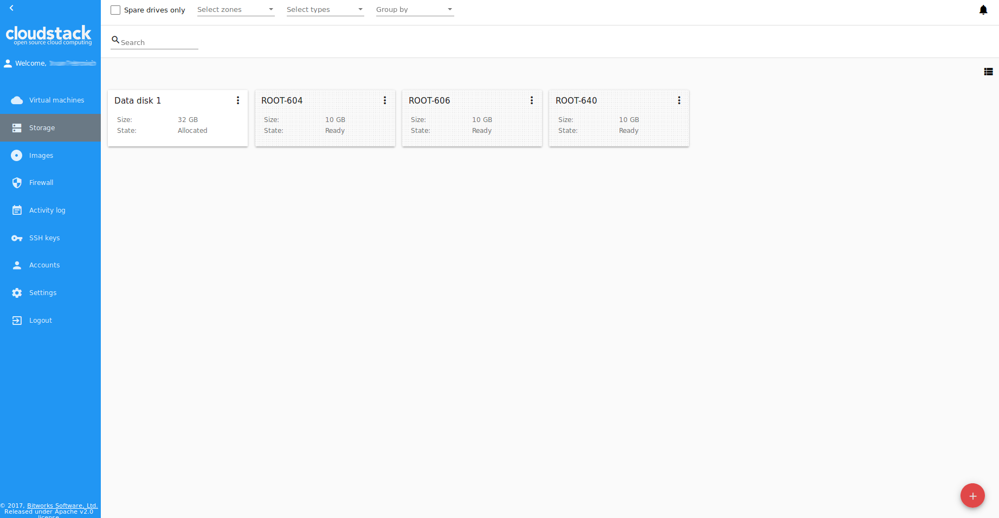

Доменный Администратор видит диски всех пользователей в домене.

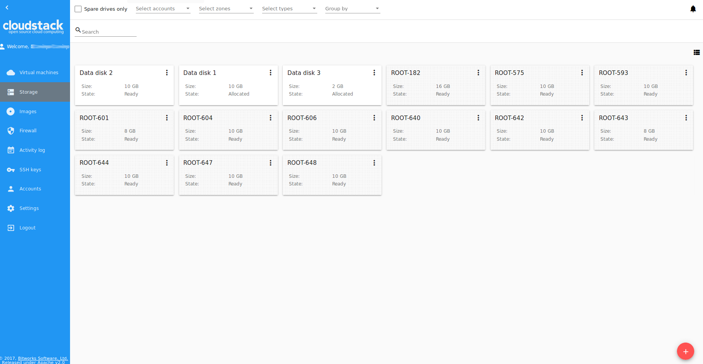

Представление дисков можно изменить с режима списка на режим карточек. Выберите удобный режим представления, нажав переключатель |view icon|/|box icon| в правом верхнем углу.

Фильтрация дисков
""""""""""""""""""""""""""
В списке дисков корневые диски отличаются от дополнительных дисков цветом. 

Сверху есть функция отображения только свободных дисков. Активируйте ее, чтобы быстро отсортировать свободные диски в списке.

Как и во всех разделах, в разделе «Хранилище» список дисков можно фильтровать по зонам и/или по типам. Также, можно искать диски по названию или его части.

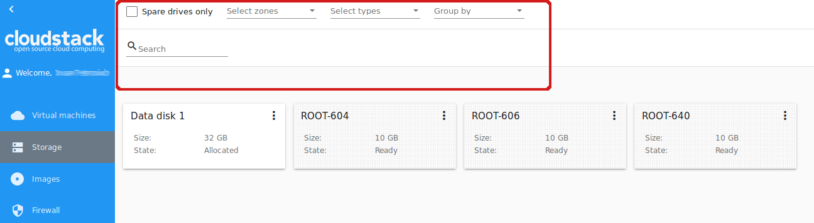

Диски можно группировать по зонам и/или типам, как на изображении ниже:

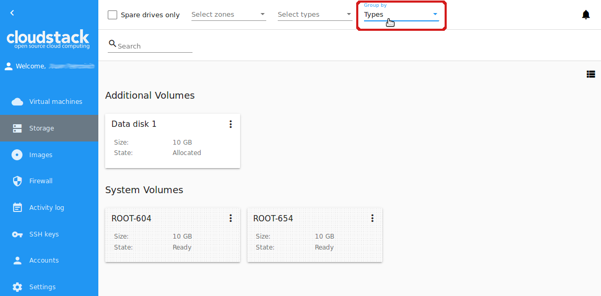

Доменному Администратору доступны диски всех аккаунтов в домене. Он может фильтровать список дисков по аккаунтам.

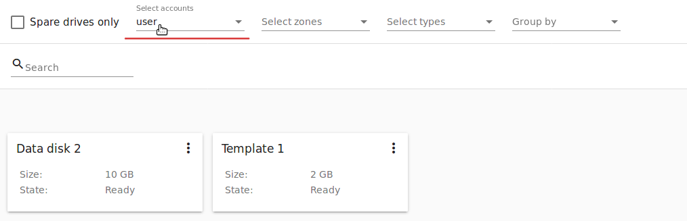

Для каждого диска в списке представлена следующая информация:

- Название диска,
- Размер,
- Статус — Готов или Аллоцирован.

Справа находится кнопка Список действий |actions icon|. Подробнее о действиях с дисками можно узнать в разделе :ref:`Actions_on_Disks_RU` ниже.

Создание нового диска
~~~~~~~~~~~~~~~~~~~~~~~~

В начале работы в CloudStack у Вас нет виртуальных машин и дисков. При создании виртуальной машины для нее автоматически создается корневой диск. Создание дополнительных дисков отнимает ресурсы и требует дополнительных затрат. Прежде, чем создавать дополнительный диск, пожалуйста, убедитесь, что он Вам действительно необходим. При создании диска система попросит подтвердить Ваше намерение создать новый диск.

Создать новый диск можно в разделе *Хранилище*.

Откройте форму создания диска, нажав кнопку создания |create icon| в правом нижнем углу.

Нажав кнопку создания, Вы увидите предупреждение: система попросит Вас подтвердить свое желание создать диск. Нажмите "Да", если Вы действительно хотите создать дополнительный диск:

.. figure:: _static/AdditionalDiskNotification.png
   :scale: 70%

В появившейся форме заполните поля:

.. note:: Обязательные поля отмечены звездочкой (*).

- Название * - Введите название диска.
- Зона * - Выберите зону из ниспадающего списка.
- Дисковое предложение * - Выберите дисковое предложение. Откройте список доступных дисковых предложений, нажав "ВЫБРАТЬ" в блоке дисковых предложений. Список доступных дисковых предложений задается Администратором. Доступность дисковых предложений определяется той зоной, которая задана в `конфигурационном файле  <https://github.com/bwsw/cloudstack-ui/blob/master/config-guide.md#offering-availability>`_.

В списке дисковых предложений для каждого предложения представлены параметры. По умолчанию представлены следующие параметры:

- Скорость чтения (Mb/s);
- Скорость записи (Mb/s);
- Скорость чтения (IO/s);
- Скорость записи (IO/s).

Администратор может расширить список параметров через конфигурационный файл <https://github.com/bwsw/cloudstack-ui/blob/master/config-guide.md#disk-offering-parameters>`_.

Выберите дисковое предложение в списке и нажмите "ВЫБРАТЬ".

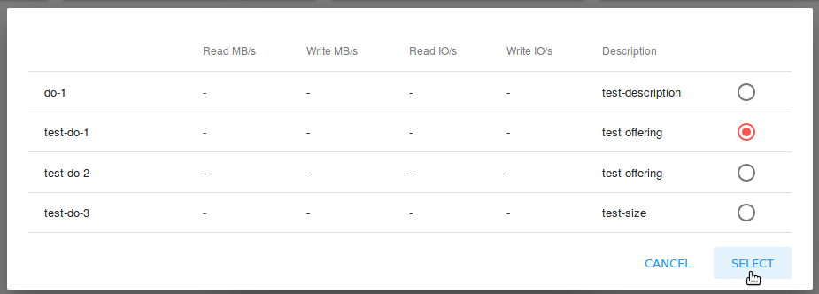
:scale: 60%

Если выбранное дисковое предложение имеет настраиваемый размер диска (устанавливается Администратором), размер диска можно изменить, двигая "бегунок" до нужного значения.

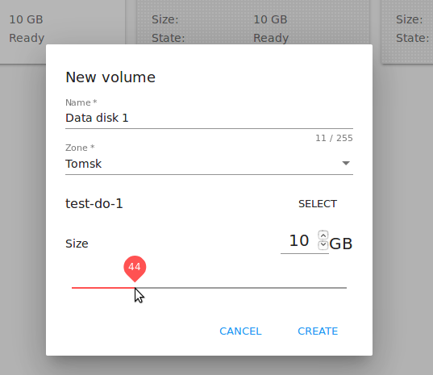

Нажмите "СОЗДАТЬ", чтобы сохранить настройки и создать новый диск. Созданный диск появится в списке дисков.

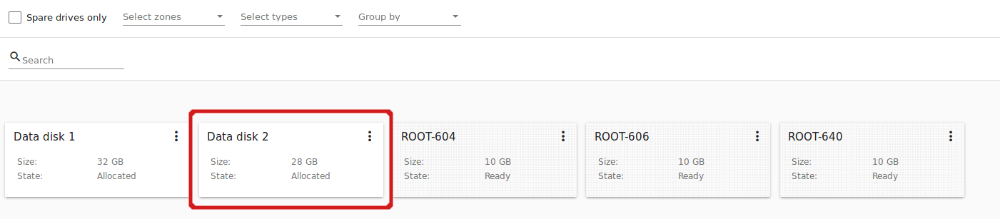

Нажмите "ОТМЕНИТЬ" для отмены создания диска.

.. _Storage_Info_RU:

Информационная панель диска
~~~~~~~~~~~~~~~~~~~~~~~~~~~~~

Нажатием на диск в списке можно открыть информационную панель справа.

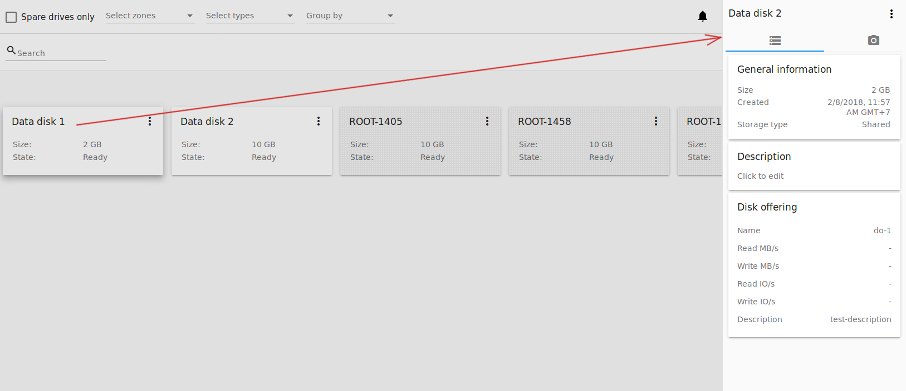

В ней — две вкладки:

1. Диск — Содержит следующую информацию о диске:

- Общая информация — Размер, дата и время создания диска, тип хранилища (общее, локальное).
- Описание — Позволяет добавить краткое описание к диску. Нажмите на блок «Описание» и введите краткое описание в текстовое поле.

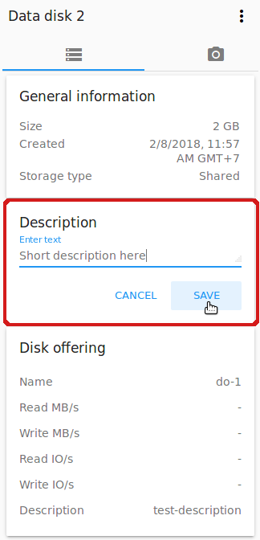

Нажмите " Сохранить", чтобы сохранить описание. Описание сохраняется в `тэги диска <https://github.com/bwsw/cloudstack-ui/wiki/Tags>`_.

Описание можно редактировать, нажав "Редактировать" |edit icon| в блоке описания.

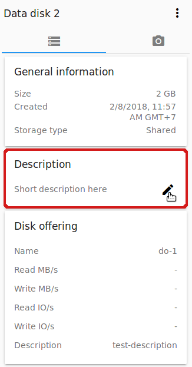

- Дисковое предложение — Содержит информацию о дисковом предложении, на основе которого был создан диск.

2. Снимки — Содержит информацию о снимках диска, если они есть. Позволяет сделать снимок диска. Снимки можно делать только для дисков со статусом Готов.

Нажмите "Добавить" |create icon| и введите в диалоговом окне:

- Имя - Название снимка. Система автоматически предлагает имя в формате  ``<дата>-<время>``. Можно ввести любое название по желанию.
- Описание - Дайте краткое описание снимку, чтобы понимать, что он содержит.

Нажмите "Создать" и созданный снимок появится в списке существующих снимков диска.

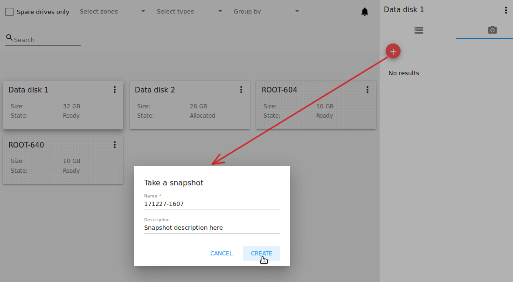
:scale: 70%

Каждый снимок сохраняется в отдельную карточку. В ней отображается название и время снимка. 

Для каждого снимка доступен список действий. Подробнее об этом написано в разделе :ref:`Actions_on_Snapshot_Volume_RU`.

.. _Actions_on_Snapshot_Volume_RU:

Список действий для снимков
""""""""""""""""""""""""""""""""""""""""

Список действий для снимков содержит тот же перечень действий, что и в Информационной панели виртуальной машины:

- **Создать шаблон** - позволяет создать из снимка шаблон, который потом можно использовать для создания ВМ.

Заполните форму для регистрации нового шаблона в системе:

    - Название * - введите имя нового шаблона.
    - Описание * - дайте краткое описание шаблона.
    - Тип OС  * - выберите тип OS из ниспадающего списка.
    - Группа — выберите группу из ниспадающего списка.
    - Пароль включен - отметьте эту опцию галочкой, если у вашего шаблона установлен скрипт изменения пароля CloudStack. То есть, машина, созданная на основе данного шаблона, будет доступна по паролю, и пароль можно изменить. 
    - Динамическое масштабирование - отметьте эту опцию галочкой, если ваш шаблон содержит инструмент XS/VM Ware для поддержки динамической масштабируемости CPU/памяти ВМ.

.. note:: Обязательные поля отмечены звездочкой (*).

Нажмите "Показать дополнительные параметры", чтобы развернуть список дополнительных параметров настройки. Откроется флажок HVM. Он позволяет создать шаблон, который требует HVM. Отметьте эту опцию, если это необходимо.
     
Как только все поля заполнены, нажмите "Создать", чтобы создать новый шаблон.

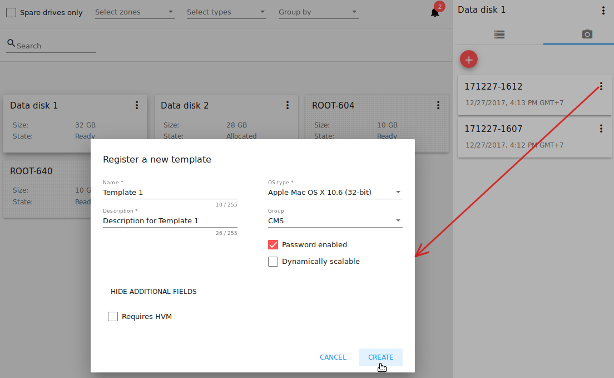
:scale: 70%

- **Создать диск** - позволяет создать диск из снимка.

Введите название нового диска в поле "Название" в открывшемся окне. Нажмите "Создать" для сохранения нового диска. 

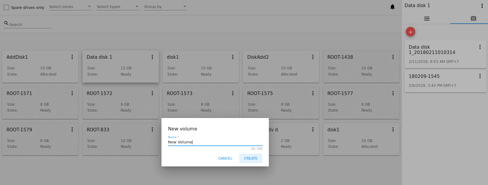

Нажмите “Отменить” для отмены создания диска.

- **Вернуть диск к снимку** - Позволяет вернуть диск обратно к состоянию снимка. 

Подствердите свое действие в диалоговом окне. In the dialogue window confirm your action. Please, note, the virtual machine the volume is assigned to will be rebooted.

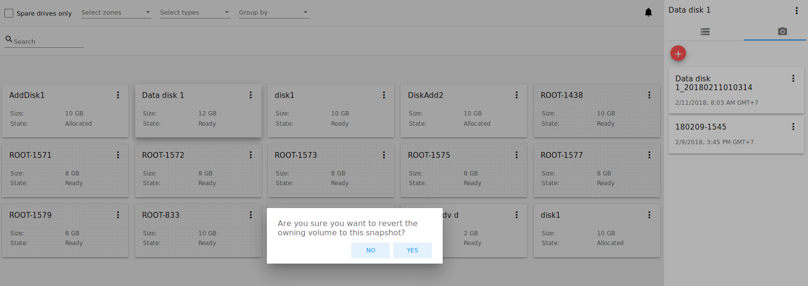

- **Удалить** - позволяет удалить снимок. Выберите "Удалить" в списке действий и подтвердите свое действие в диалоговом окне. Снимок будет удален. Нажмите "Отменить" для отмены удаления снимка.

.. Find the detailed description in the :ref:`Actions_on_Snapshots` section.

.. _Actions_on_Disks_RU:

Список действий для дисков
~~~~~~~~~~~~~~~~~~~~~~~~~~

Раскройте список действий для дисков, нажав |actions icon| рядом с названием диском в списке или в информационной панели.

Список действий с диском включает в себя:

Для корневых дисков:

 - Сделать снимок;
 - Установить расписание для снимков;
 - Изменить размер диска.
        
Для диска данных:
       
 - Сделать снимок;
 - Установить расписание для снимков;
 - Отсоединить;
 - Изменить размер диска;
 - Удалить.
 
**Сделать снимок**

Снимок диска позволяет сохранить диски данных. Данное действие доступно только для дисков со статусом "Готов".

Нажмите "Сделать снимок" в списке действия к диску и в диалоговом окне введите:

 - Имя снимка * - укажите имя для снимка. Система автоматически генерирует имя в формате ``<дата>-<время>``. Но Вы можете указать любое имя по желанию.
 - Описание — Добавьте краткое описание снимка диска.

.. note:: Обязательные поля обозначены звездочкой (*).

Все снимки сохраняются в список снимков диска. Для снимков доступны следующие действия:

- Создать шаблон;
- Удалить снимок.

Более подробно действия со снимками описаны в разделе :ref:`Actions_on_Snapshot_Volume_RU`.

**Утсановить расписание для снимков**

Данное действие доступно только для дисков со статусом "Готов".

Расписание создания снимков можно установить, нажав "Установить расписание для снимков" в списке действий.

В появившемся окне установить график периодического создания снимков:

 - Выберите частоту создания снимков — каждый час, каждый день, каждую неделю, каждый месяц;
 - Выберите минуту (для почасового создания снимков), время (для ежедневного создания снимков), день недели (для еженедельного создания снимков) или день в месяце (для ежемесячного создания снимков), когда снимок должен быть сделан;
 - Выберите временную зону, в соответствии с которой расписание будет выполняться;
 - Установите количество снимков, которое должно быть создано.

Нажмите "+", чтобы сохранить расписание.  Можно создать несколько графиков создания снимков, но не более одного для каждого типа расписания  (почасового, ежедневного, еженедельного, помесячного).

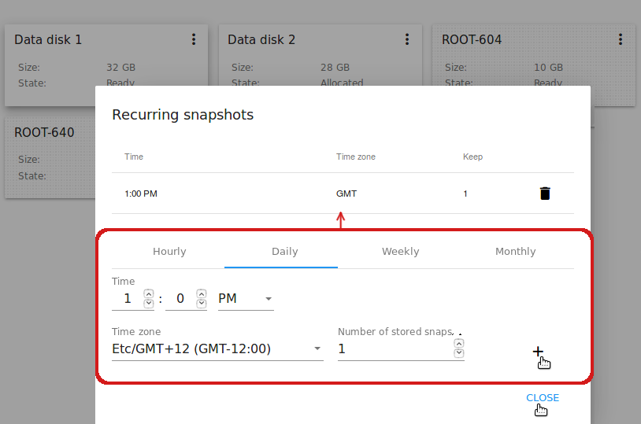
:scale: 70%

**Изменить размер диска**

.. note:: Данное действие доступно для дисков данных, созданных на основе дискового предложения с размером диска, устанавливаемого пользователем. Такие дисковые предложения могут создать только Администраторы.

Выбрав "Изменить размер диска" в списке действий Вы сможете увеличить/уменьшить размер диска.

В появившемся окне установите новый размер, двигая «бегунок». Кликните "Изменить размер" для сохранения изменений.

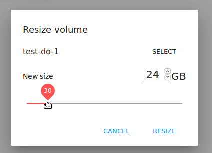

Нажмите "Отменить", чтобы сбросить все изменения.

**Прикрепить/Открепить**

Данное действие можно применить к дискам данных. Оно позволяет прикрепить/открепить диск к/от виртуальной машины.

Нажмите "Прикрепить" в списке действий и в появившемся окне выберите машину, к которой следует прикрепить диск. Нажмите "Прикрепить" в диалоговом окне.

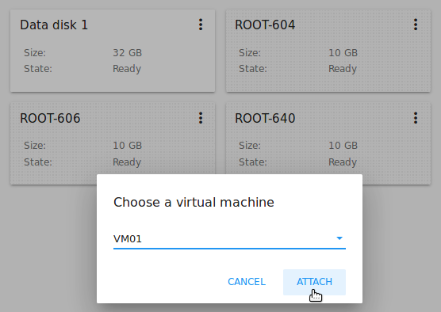

Прикрепленный диск можно открепить. Нажмите "Открепить" в списке действий и подтвердите свое действие в диалоговом окне. Диск данным будет откреплен от машины. 

**Удалить**

Данное действие можно применить к дискам данных. Оно позволяет удалить диск данных из системы.

Нажмите "Удалить" в списке действий  и подтвердите свое действие в диалоговом окне.

Если у диска есть снимки, система спросит, хотите ли Вы удалить их вместе с удалением диска. Нажмите "Да", чтобы удалить снимки. Нажмите "Нет", чтобы сохранить снимки в системе после удаления диска.

Диск данных будет удален из системы в тот же момент.

.. |bell icon| image:: _static/bell_icon.png
.. |refresh icon| image:: _static/refresh_icon.png
.. |view icon| image:: _static/view_list_icon.png
.. |view box icon| image:: _static/box_icon.png
.. |view| image:: _static/view_icon.png
.. |actions icon| image:: _static/actions_icon.png
.. |edit icon| image:: _static/edit_icon.png
.. |box icon| image:: _static/box_icon.png
.. |create icon| image:: _static/create_icon.png
.. |copy icon| image:: _static/copy_icon.png
.. |color picker| image:: _static/color-picker_icon.png
.. |adv icon| image:: _static/adv_icon.png
