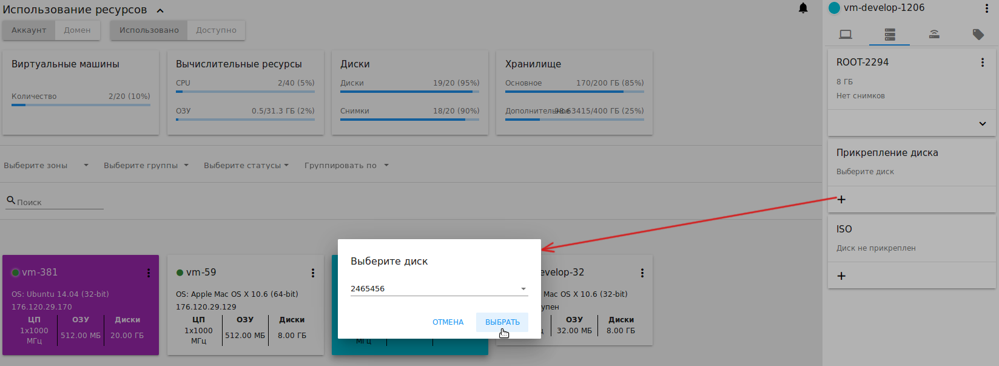

Виртуальные машины
-------------------------------

.. Contents::

Это первый раздел, который видит пользователь при входе в систему. Здесь и во всех других вкладках мы осуществили подход “одного шага”,  без необходимости переключаться между разделами. Таким образом, все действия с ВМ могут быть произведены с одной панели.

Список виртуальных машин
~~~~~~~~~~~~~~~~~~~~~~~~~~~~~

На этой странице Вы видите список виртуальных машин, доступных только Вашему пользователю.


Если Вы Администратор домена, Вы видите виртуальные машины всех пользователей в Вашем аккаунте. Возможна фильтрация машин по аккаунту. При выборе всех аккаунтов в блоке "Выбрать аккаунт" в списке будут отображаться виртуальные машины для всего домена.


   
Вы можете просматривать список существующих виртуальных машин в виде "карточек", или изменить вид списка на "список". Мы добавили переключатель |view icon| / |box icon| в верхнем правом углу каждого раздела. Это улучшение дает пользователю возможность работать с данными в каждом определенном разделе более удобным способом.

Режим списка можно изменить на "карточки":


Или наоборот, переключите карточки на список:


В списке существующих виртуальных машин для каждой машины отображается следующая информация: 

- Имя ВМ и IP;
- Статус — показывает статус машины цветом: зеленый - работает, красный - остановлена, желтый — изменение статуса;
- OС;
- ЦП;
- ОЗУ;
- Диски.

Справа под кнопкой Действия |actions icon| можно посмотреть список действий доступных для ВМ.

Фильтрация виртуальных машин
~~~~~~~~~~~~~~~~~~~~~~~~~~~~~~~~

Инструмент фильтрации и поиска поможет Вам найти виртуальную машину в списке.


   
Вы можете отфильтровать список ВМ по аккаунтам (доступно для Администратора Домена) и/или по зонам и/или по группам и/или по статусу. В выпадающих списках отметьте необходимые параметры фильтрации. Список будет мгновенно отсортирован/отфильтрован.

Кроме того, ВМ могут быть сгруппированы по зонам и/или группам и/или цветам и/или аккаунтам. Группировка позволяет быстро определить необходимую ВМ в списке.


   
Воспользуйтесь поиском, чтобы найти виртуальную машину по ее имени или части имени.

Внизу раздела *Виртуальные машины* Вы можете открыть форму создания новой виртуальной машины.

.. _Create_VM_RU:

Создание виртуальной машины
~~~~~~~~~~~~~~~~~~~~~~~~~~~~~
Виртуальная машина в CloudStack-UI создается в один шаг. Выбор опций осуществляется из одного окна без дополнительных переходов в другие разделы.

Для создания виртуальной машины кликните "Создать" |create icon| в нижнем правом углу. 


   
В форме создания ВМ заполните следующие поля:

.. note:: Обязательные поля отмечены звездочкой (*).

1. **Название** * -   название ВМ. Система предлагает автоматически сгенерированое имя в следующем формате:  ``vm-<username>-<counter>``.  Можно задать любое имя, которое начинается с буквы, содержит цифры и буквы латинского алфавита и является уникальным в домене. 
2. **Зона** * - зона, в которой доступна ВМ. Выберите зону из ниспадающего списка. Список доступных зон конфигурируется Администратором. Больше информации о зонах вы найдете в `официальной документации <http://docs.cloudstack.apache.org/en/latest/concepts.html?highlight=zone#about-zones>`_.
3. **Вычислительное предложение** * -  набор опций и ресурсов, из  которых пользователь может выбирать, например, шаблоны для создания ВМ, дисковое пространство, др. Список доступных ресурсов конфигурируется Администратором. Доступные вычислительные предложения определяются той зоной, которая задана в `конфигурационном файле <https://github.com/bwsw/cloudstack-ui/blob/master/config-guide.md#offering-availability>`_.

Кликните "ВЫБРАТЬ" в блоке "Вычислительные предложения" и выберите в открывшемся окне необходимую опцию. Вычислительные предложения представлены в двух отдельных списках в зависимости от их типа: Фиксированные и Настраиваемые. 

*Фиксированные* предложения - это предложения с фиксированными параметрами, которые нельзя редактировать.

*Настраиваемые* вычислительным предложения - это предложения с настраиваемыми параметрами. Для них есть возможность задать нужное количество ядер ЦП, размеры CPU, памяти, скорость сети. 

Для переключения между списками предложения разных типов используйте переключатель вверху списка.

Если в конфигурационном файле определены классы вычислительных предложений (см. раздел :ref:`ServiceOfferingClasses_RU` руководства по конфигурациям), вычислительные предложения в списке будут сгруппированы по заданным классам. В таком случае для списка можно использовать фильтрацию по классам. Блок фильтрации находится над списком предложений. Добавление классов позволяет применить дополнительную семантику в наименовании машин.

.. figure:: _static/VMs_Create_SOClasses.png

Также, возможно применения поиска к списку предложений. Введите название или его часть в поле поиска над списком предложений, чтобы быстро найти в списке нужную опцию.

**Фиксированные вычислительные предложения**

В списке фиксированных вычислительных предложений для каждого предложения в таблице приводятся параметры. По умолчанию представлены следующие параметры:

- Ядра CPU;
- CPU (MHz);
- Память (MB);
- Скорость сети (Mb/s).

Нажав "ПОКАЗАТЬ ДОПОЛНИТЕЛЬНЫЕ ПАРАМЕТРЫ" внизу списка Вы расширите список параметров в таблице. Воспользуйтесь "бегунком" для передвижения вправо по таблице, где представлены следующие дополнительные параметры:

- Скорость чтения (Mb/s);
- Скорость записи (Mb/s);
- Скорость чтения (IO/s);
- Скорость записи (IO/s).

Чтобы скрыть дополнительные параметры, нажмите "СКРЫТЬ ДОПОЛНИТЕЛЬНЫЕ ПАРАМЕТРЫ" внизу списка.


   
Выберите в списке нужное предложение и нажмите "ВЫБРАТЬ" внизу списка.


Выбранные настройки появятся в блоке "Вычислительные предложения" для создаваемой машины.

**Настраиваемые вычислительные предложения**

В списке настраиваемых вычислительных предложений для каждого предложения также представлены параметры. Можно расширить список параметров, нажав "Показать дополнительные параметры" внизу списка.

При выборе одного из вариантов предложений в списке откроется модальное окно, в котором для каждого параметра можно задать значение:

- Ядра CPU;
- CPU (MHz);
- Память (MB).

Значения для данных параметров могуть быть предзаданы Администратором в конфигурационном файле (см. раздел :ref:`DefaultServiceOffering_RU` в руководстве по конфигурациям). Они будут использоваться по умолчанию для настраиваемых вычислительных предложений.

Также, в конфигурационном файле Администратором могут быть заданы лимиты для параметров предложений (см. раздел :ref:`SO_Limits_RU`). Т.е. при определении значений параметров предложений нельзя будет указать значения, превышающие заданные лимиты.


 
Когда параметры заданы, нажмите "ПРИНЯТЬ" для сохранения заданных параметров. Они появятся в списке параметров настраиваемых предложений для выбранного варианта. Или нажмите "ОТМЕНИТЬ" для отмены сохранения заданных вариантов.

Нажмите "ВЫБРАТЬ" внизу списка для присоединения выбранного вычислительного предложения к создаваемой машине. Настроенные параметры будут отображаться в блоке "Вычислительные предложения" в форме создания ВМ. Параметры настраиваемых вычислительных предложений сохраняются в теги аккаунта (см. `список тегов <https://github.com/bwsw/cloudstack-ui/wiki/Tags>`_), если данные теги активированы для аккаунта. Это значительно упрощает использование сохраненных параметров настраиваемых предложений в дальнейшем при создании ВМ, т.к. они будут автоматически предзаданы в форме создания ВМ. Активировать теги для аккаунта может только Администратор через конфигурационный файл (см. раздел :ref:`AccountTags_RU`). 

Выбранные вычислительные предложения можно изменить, нажав "ВЫБРАТЬ" рядом с настройками в форме создания ВМ и выбрав другой вариант предложения в списке. Сделав выбор, нажмите "ИЗМЕНИТЬ" внизу списка для присоединения выбранного предложения к ВМ.


    
4. **Источник установки** * - Выберите способ установки ВМ, нажав "ВЫБРАТЬ". Обычно ВМ создают двумя способами:
    
    - Из шаблона. 
    - Из ISO файла.
    
   В открывшемся модальном окне появится список шаблонов/ISO со статусом "Готов". Доступные шаблоны/ISO представлены в разных списках. Откройте нужный, используя переключатель сверху. Список доступных источников зависит от выбранной зоны и аккаунта пользователя. Инструмент фильтрации позволяет найти необходимую опцию среди шаблонов/ISO по семьям OS, типам и группам, или по названию или его части. 

   Отметьте источник в списке и нажмите "ВЫБРАТЬ", чтобы применить выбранный источник к ВМ.
   
   Нажмите "Отменить", чтоб сбросить все опции. Тогда источник не будет выбран.   


    
5. **Дисковое предложение** * -  Данная опция доступна при создании ВМ из ISO. Откройте список доступных дисковых предложений, нажав "ВЫБРАТЬ" в блоке дисковых предложений. Список доступных дисковых предложений задается Администратором. Доступность дисковых предложений определяется той зоной, которая задана в конфигурационном файле (см. раздел :ref:`OfferingAvailability_RU`).

В списке дисковых предложений для каждого предложения представлены параметры. По умолчанию представлены следующие параметры:

- Скорость чтения (Mb/s);
- Скорость записи (Mb/s);
- Скорость чтения (IO/s);
- Скорость записи (IO/s).

Администратор может расширить список параметров через конфигурационный файл (см. раздел :ref:`DiskOfferingParameters_RU`).

Выберите дисковое предложение в списке и нажмите "ВЫБРАТЬ".


Если выбранное дисковое предложение имеет настраиваемый размер диска (устанавливается Администратором), размер диска можно изменить, двигая "бегунок" до нужного значения.


Больше информации о дисковом предложении можно найти в `официальной документации <http://docs.cloudstack.apache.org/projects/cloudstack-administration/en/latest/service_offerings.html?highlight=Disk%20offering#compute-and-disk-service-offerings>`_.

6. **Группа** —  Выберите группу из ниспадающего списка. Или создайте новую группу, вписав ее название прямо в поле. Заданная группа будет сохранена в `теги машины <https://github.com/bwsw/cloudstack-ui/wiki/Tags>`_. 
7. **Аффинитетная группа** - Выберите группу из ниспадающего списка. Или создайте новую группу, вписав ее название прямо в поле. Название должно начинаться с буквы, содержать буквы, цифры и не иметь пробелов. Количество символов не должно превышать 63. Больше информации об аффинитетных группах можно найти в `официальной документации <http://docs.cloudstack.apache.org/projects/cloudstack-administration/en/latest/virtual_machines.html?highlight=Affinity#affinity-groups>`_.
8. **Брандмауэр** - Нажмите "РЕДАКТИРОВАТЬ" и задайте группу безопасности для ВМ. В появившемся окне выберите "Создать" или "Выбрать общую". 
  
**Создать новую группу безопасности**

Новая группа безопасности создается на основе выбранных шаблонов. Эта группа безопасности будет создана как *частная* группа, используемая только для данной ВM.

Создавая новую группу безопасности, Вы увидите, что в модальном окне по умолчанию отобраны все шаблоны. Чтобы сформировать Вашу группу безопасности, выберите шаблон в списке "Все шаблоны" слева и переместите его в список "Выбранные шаблоны" справа, кликнув на стрелку:
   

   
Кликните "ВЫБРАТЬ ВСЕ" чтобы одновременно переместить все шаблоны слева направо.

Кликните "СБРОСИТЬ", чтобы сбросить все выбранные шаблоны.

В списке ниже Вы увидите правила, соответствующие выбранным шаблонам. Все они отмечены как выбранные. Снимите флажок с тех, которые Вы не хотите добавлять к создаваемой ВM в качестве правил группы безопасности.

Нажмите "СОХРАНИТЬ", чтобы применить выбранные правила к виртуальной машине.

Нажмите "ОТМЕНИТЬ", чтобы сбросить выбранные варианты. Правила не будут заданы для виртуальной машины. Вы вернетесь к форме создания виртуальной машины.
   
**Выбрать общую группу безопасности**
   
Если Вы хотите бы выбрать существующую группу правил брандмауэра, Вы можете нажать "Выбрать общую" и пометить те группы в списке, который Вы хотите задать для ВМ. Группы безопасности в  этом списке используются другими ВМ в домене. Это означает, что Вы не сможете отключить отдельные правила группы, если Вы не хотите включать их в группу безопасности (как при создании VM из шаблона). Вы можете назначить для ВМ только всю группу безопасности целиком.
   


Отредактировать общую группу безопасности можно после создания ВМ. Во вкладке *Сеть* информационной панели ВМ можно посмотреть и редактировать выбранную общую группу (группы) безопасности. Больше информации о редактировании группы безопасности вы найдете в разделе :ref:`VM_Network_Tab_RU`.

Нажмите "ОТМЕНИТЬ", чтобы сбросить все выбранные варианты.  Правила не будут заданы для виртуальной машины.
   
8. **Раскладка клавиатуры** * - (предзадана). Выберите раскладку клавиатуры из ниспадающего списка.
9. **SSH ключ** — Выберите ключ SSH. Список ключей содержит те ключи, которые доступны для аккаунта, в котором создана ВМ. См. подробнее о ключах безопасности в разделе :ref:`SSH_Keys_RU`.
10. **Запустить ВМ** — Поставьте здесь галочку, если Вы хотите запустить ВМ сразу после ее создания. При активации данной опции виртуальная машина получит свой IP и пароль (если это задано в настройках шаблона). Если данная опция не активирована, IP машины не доступен до запуска ВМ. Пароль ей не присваивается.  

После заполнения всех полей нажмите "СОЗДАТЬ".

Для некоторых шаблонов/ISO, используемых при создании ВМ, Вам предлагается принять условия договора на использование выбранного шаблона или ISO. Администратор может определить в таком соглашении, например, программное обеспечение, условия лицензирования или ограничения ответственности продавца шаблонов программного обеспечения. Пользователь должен согласиться с этими условиями, чтобы продолжить установку ВМ на основании выбранного источника. 

Если Вы создаете виртуальную машину на основе шаблона/ISO, который требует соглашения, прочитайте условия в появившемся окне и нажмите "СОГЛАСЕН", чтобы продолжить.

.. figure:: _static/VMs_Create_Agreement.png

Или нажмите "ОТМЕНИТЬ", закройте условия и вернитесь к форме создания ВМ. Выберите другой источник для создания ВМ.

После нажатия "Создать" появится диалоговое окно, где Вы можете наблюдать процесс создания и установки ВМ: создание группы безопасности, установку ВМ, копирование тегов шаблонов, др. Эти процессы выполняются последовательно. Выполняемый в данный момент процесс отмечен индикатором выполняемого процесса. В случае возникновения ошибки на каком-либо шаге создания ВМ, пользователь сможет понять, в каком именно процессе произошла ошибка. 


По окончании создания ВМ появится сообщение об успешном создании ВМ.


   
В сообщении будет указан список всех шагов создания ВМ и информация о ней:

- Имя ВМ и IP (если он доступен),
- Пароль ВМ — Пароль создается автоматически после создания ВМ, если пароль задан для шаблона, используемого для создания этой машины. Нажмите "СОХРАНИТЬ" рядом с паролем в диалоговом окне, если Вы хотите сохранить пароль для данной ВМ. Пароль будет сохранен в теги виртуальной машины. Просмотр сохраненного пароля возможен при нажатии "Доступ к ВМ" в списке Действий для данной машины.

.. figure:: _static/RU_VMs_Create_Dialogue_SavePass.png

При сохранении пароля система спросит, хотите ли Вы сохранять пароли в теги для будущих ВМ по умолчанию. Нажмите "Да", и в настройках учетной записи будет активирована опция "Сохранять пароль ВМ по умолчанию":


Это означает, что пароли для всех созданных виртуальных машин будут сохраняться в теги ВМ автоматически.

Также, из окна сообщения Вы можете получить доступ к ВМ, открыв VNC консоль.

.. API log 

Закройте диалоговое окно и удостоверьтесь, что недавно созданная ВМ находится в списке виртуальных машин.

Нажмите "ОТМЕНИТЬ", чтобы закрыть окно создания ВМ без сохранения новой ВМ.

Возможные трудности при создании ВМ
""""""""""""""""""""""""""""""""""""""""""""""""""""""""""
При создании виртуальной машины Вы можете столкнуться со следующими проблемами:

- Недостаток ресурсов.

  Важный аспект в CloudStack-UI заключается в том, что система немедленно проверяет, есть ли у пользователя ресурсы, требуемые для создания виртуальной машины. Система не позволяет начинать создание ВМ, для запуска которой не хватит ресурсов.

  Если необходимого количества ресурсов не достаточно, при нажатии на кнопку создания ВМ появится сообщение:

   "Недостаточно ресурсов. Нет места в Основном хранилище." 

  В этом случае форма создания ВМ будет не доступна.

.. При недостатке ресурсов создание новой ВМ и ее запутить после создания будут недоступны. Вы сможете создать новый ВМ без отметки "Запустить VM" в форме. IP в этом случае не будет назначен для ВМ.

- Имя ВМ не уникально в домене.

  Если имя, определенное для виртуальной машины, не уникально в домене, в диалоговом окне после создания ВМ появится ошибка, ВМ не будет создана, форма создания ВМ закроется. Вам придется открыть форму создания ВМ и заполнить ее снова. Вы должны будете ввести другое название для ВМ.

.. _VM_Actions_RU:

Список действий с ВМ
~~~~~~~~~~~~~~~~~~~~~~~~~~~~~~~~~~
Как только ВМ создана, ее можно остановить, перезапустить или удалить по мере необходимости. Эти действия доступны под кнопкой "Действия" |actions icon| справа для каждой виртуальной машины в списке. 


   
Вы можете совершать следующие действия с ВМ:

- Запустить ВМ — позволяет пользователю запустить ВМ, 

- Остановить ВМ - позволяет пользователю остановить запущенную ВМ, 

- Перезапустить ВМ - позволяет пользователю перезапустить ВМ, 

- Переустановить ВМ - позволяет пользователю заново переустановить ВМ, 

- Удалить ВМ - позволяет пользователю удалить ВМ.  После удаления машина еще остается в системе, но в списке она выделена серым цветом.  Позднее машину можно восстановить.


Чтобы восстановить удаленную машину (которая еще не уничтожена), откройте список действий и кликните "Восстановить".


Нажмите "Уничтожить" для полного удаления ВМ из системы без возможности последующего восстановления. 


Если у машины есть диски, система спросит в диалоговом окне, следует ли удалить диски машины. Если у дисков есть снимки, система также предложит удалить снимки, активировав опцию "Удалить снимки".  

Подтвердите свое желание удалить диски (и снимки), нажав "Да". Нажмите "Нет" для отмены удаления дисков (и снимков).

.. figure:: _static/VMs_Destroy_DeleteSnaps.png

- Изменить пароль — позволяет пользователю изменить пароль ВМ (доступно только для запущенных ВМ  в случае, если пароль необходим для данной ВМ). 


После нажатия "Да" в диалоговом окне ВМ будет перезапущена, и для нее будет сгенерирован новый пароль, который появится в диалоговом окне.


Нажмите "Сохранить", чтобы сохранить новый пароль для данной ВМ. Это действие активирует опцию "Сохранять пароли для ВМ по умолчанию" в настройках учетной записи (см. подробнее в разделе :ref:`Settings_VMPass`). В будущем пароли будут сохраняться автоматически при создании ВМ. Нажмите "OK", чтобы закрыть диалоговое окно. 

- Доступ к ВМ -  открывает диалоговое окно "Доступ к ВМ", которое позволяет просматривать имя ВМ и IP, а также  сохраненный пароль ВМ, и дает доступ к ВМ через VNC консоль.


В разделе :ref:`VM_Access_RU`  подробно описаны варианты доступа к ВМ.

- Пульс — это новая функциональность, созданная в CloudStack-UI для отображения статистики работы ВМ. Выбрав "Pulse" в списке действий, Вы откроете модальное окно с тремя вкладками: CPU/RAM, Сеть, Диск. В них Вы найдете графики использования ресурсов ВМ. 


Отображение графиков можно настроить, меняя период агрегации данных, интервал сдвига и другие параметры. 

Данный плагин удобен для динамического мониторинга работы машины. Вы найдете больше информации об этом плагине в разделе :ref:`Pulse`. Инструкции по установке плагина Пульс можно найти в разделе :ref:`PulseDeployment_RU`.

.. note:: При выборе одного из действий в списке другие действия в списке становятся недоступны до завершения выбранного действия.

.. _VM_Info_RU:

Информационная панель виртуальной машины
~~~~~~~~~~~~~~~~~~~~~~~~~~~~~~~~~~~~~~~~~~~~

Для каждой виртуальной машины в боковой панели справа можно открыть информационный блок, кликнув на ВМ в списке или на карточку ВМ.


   
В панели отображается следующая информация:

1. Имя VM.
2. Цветовой указатель |color picker| -  позволяет выделить виртуальную машину цветом из палитры. 
3. Список действий для ВМ. См. подробнее в разделе  :ref:`VM_Actions_RU` ниже.

В панели Вы увидите 4 вкладки. Ниже будет описана информация, представленная в каждой вкладке.

Вкладка "Виртуальная машина"
"""""""""""""""""""""""""""""""""""""""""""""""
Вкладка "Виртуальная машина" содержит основные настройки ВМ. Некоторые настройки в ней можно редактировать.  В конце находится раздел *Статистика*, которая отображает данные по работе ВМ в реальном времени. 

1. Описание - краткое описание ВМ. Щелкните по блоку, чтобы отредактировать его. Введите несколько слов о ВМ. Нажмите "Сохранить", чтобы сохранить описание. Это описание для Вашей машины сохранится с тегом ``csui.vm.description``.

Описание можно редактировать, кликнув "Редактировать" |edit icon| и изменив описание в текстовом поле. 


Также, описание можно редактировать из вкладки тегов. Кликните "Редактировать" рядом с тегом ``csui.vm.description`` и измените описание в появившейся форме.


2. Зона — зона, в которой ВМ будет доступна.

#. Группа — группа, которая указана для ВМ. Редактируйте данное поле, кликнув "Редактировать" |edit icon|.  В появившемся диалоговом окне выберите группу из ниспадающего списка и кликните "Применить" для добавления группы к ВМ. 


   
Вы также можете создать новую группу, вписав название группы прямо в текстовое поле в диалоговом окне. Кликните "Применить" для добавления группы к ВМ. 


   
Для удаления ВМ из группы выберите "Удалить из группы" и кликните "Удалить".


   
Группа ВМ это группа, задаваемая пользователем. Она сохраняется в теги машины с тегом ``csui.vm.group``. Ее можно редактировать или удалить из вкладки "Теги". 

4. Вычислительные предложения - предложения вычислительных ресурсов VM. Раскройте раздел, чтобы  просмотреть весь список предложений. 

Редактируйте это поле, нажав кнопку "Редактировать" |edit icon|. В появившемся окне откроется список доступных предложений.

Список состоит из двух разделов - *Фиксированные* и *Настраиваемые*. В каждом разделе можно фильтровать предложения по классам, если для предложений заданы классы. Задать классы вычислительных предложений можно в конфигурационном файле (см. подробнее в разделе :ref:`ServiceOfferingClasses_RU`).

.. figure:: _static/VMs_Create_SOClasses.png 

Также, можно воспользоваться поиском и ввести в поле поиска название или часть названия предложения, чтобы быстрее найти его в списке. 

Выберите в списке вариант предложения. 


Нажмите "Изменить", чтобы сохранить выбранную опцию. При редактировании вычислительного предложения запущенная виртуальная машина будет перезапущена.

5. Аффинитетная группа — аффинитетная группа ВМ. Редактируйте поле кликнув "Редактировать" |edit icon|. В диалоговом окне выберите существующую группу из спика или создайте новую прямо в данном окне. Кликните "Применить" для добавления группы к ВМ. 


    
При добавлении группы к запущенной машине система предложит остановить ВМ. Нажмите "OK" в диалоговом окне. Затем машина будет снова запущена.


   
Можно удалить выбранную группу, кликнув "Редактировать" и выбрав "Удалить из группы" в диалоговом окне.


   
6. Шаблон — отображает шаблон, используемый при создании ВМ.

#. Ключ SSH  - отображает ключ SSH данной ВМ. Добавьте ключ SSH, кликнув "+". В появившемся окне выберите ключ SSH из ниспадающего списка и кликните "ИЗМЕНИТь":


   
При сохранении нового ключа SSH для работающей ВМ появится предупреждение: "При переустановке ключа SSH необходимо остановить виртуальную машину." Кликните "OK", если Вы хотите остановить ее. Нажмите "ОТМЕНИТЬ", чтобы сбросить все настройки.

7. Статистика — отображает статистику использования CPU машиной, Сеть чтения, Сеть записи, Скорость чтения, Скорость записи, Скорость чтения (IO), Скорость записи (IO). Обновите данные, нажав "Обновить" |refresh icon| в правом верхнем углу.
    
Вкладка «Диски»
"""""""""""""""""""""""""""
Во второй вкладке - "Диски" — содержится информация по объемам дисков, выделенных для ВМ. 


   
Здесь доступна следующая информация:

1. **Информация о диске** 

Каждая ВМ имеет корневой диск. Кроме этого, машине можно добавить дополнительный диск.

Для корневого диска представлена следующая информация (разверните карточку, чтоб увидеть полный список данных):

- Имя — Имя диска.
- Размер — Размер диска.
- Дата и время создания. 
- Тип хранилища (общее/локальное).
- Информация о последнем сделанном снимке. 

2. **Добавить диск** - Позволяет добавить диск к ВМ.

К ВМ можно присоединить дополнительный объем памяти (диск). Нажмите "Выбрать", чтобы выбрать диск. Выберите диск в списке и нажмите "Выбрать". 


   
Выбранный диск появится во вкладке виртуальной машины с кнопкой "Прикрепить". Нажмите "Прикрепить", чтобы подключить выбранный диск к виртуальной машине.


Если в системе нет доступных дисков, Вы можете создать его прямо из панели информации.


Нажмите "Создать новый диск" и Вы переместитесь в раздел *Хранилище*. Появится форма создания диска, где необходимо указать:

.. note:: Обязательные поля отмечены звездочкой (*).

- Название * - укажите имя нового дополнительного диска.
- Зона * - выберите зону для него из ниспадающего списка. 
- Дисковое предложение * - кликните "ВЫБРАТЬ" и выберите дисковое предложение из открывшегося списка. Список дисковых предложений задается Администратором. 
- Размер — установите размер диска, если это доступно. Размер диска можно изменить, если выбрано дисковое предложение, настраиваемое пользователем. 

Заполнив все поля нажмите "СОЗДАТЬ" для сохранения нового диска. 

Нажмите "ОТМЕНА", чтобы сбросить все настройки и отменить создание диска.

.. figure:: _static/RU_VMs_AttachVolume_Create1.png
   
Вернитесь обратно к информационной панели виртуальной машины. Во вкладке "Диски" в разделе *Добавить диск* кликните "+", чтобы выбрать дополнительный диск. Выберите дополнительный диск из ниспадающего списка и нажмите "Выбрать", чтобы добавить его к разделу *Добавить диск*. Чтобы присоединить диск к ВМ нажмите кнопку "Присоединить".

.. _Disk_action_box_RU:

Список действий с диском
'''''''''''''''''''''''''''''''''''''''''''''''''''''''''''''''''''''''''

Для каждого диска можно открыть список действий, кликнув |actions icon|.

В списке доступны следующие действия для дисков:

Для корневых дисков:

 - Сделать снимок;
 - Установить расписание для снимков;
 - Изменить размер диска.
        
Для дополнительных дисков:
       
 - Сделать снимок;
 - Установить расписание для снимков;
 - Отсоединить;
 - Изменить размер диска;
 - Удалить.
  
**Сделать снимок**
  
Для сохранения всех дисков ВМ, а также состояния ее CPU/памяти можно сделать снимок ВМ. Из снимка можно быстро восстановить машину. 
  
Нажмите "Сделать снимок" в списке действия к диску и в диалоговом окне введите:

.. note:: Обязательные поля обозначены звездочкой (*).

 - Имя снимка * - укажите имя для снимка. Система автоматически генерирует имя в формате ``<дата>-<время>``. Но Вы можете указать любое имя по желанию.
 - Описание — добавьте краткое описание снимка диска. 


Все снимки сохраняются в списке снимков. В разделе информации о диске Вы увидите имя и время *последнего* сделанного снимка.  Для каждого снимка доступны действия, описанные в разделе :ref:`Actions_on_Snapshots_RU` ниже.

**Установить расписание для снимков**

Для снимков можно задать расписание, кликнув "Установить расписание для снимков" в списке действий.

В появившемся окне установить график периодического создания снимков:

 - Выберите частоту создания снимков — ежечасно, ежедневно, еженедельно, ежемесячно;
 - Выберите минуту (для ежечасного создания снимков), время (для ежедневного создания снимков), день недели (для еженедельного создания снимков) или день в месяце (для ежемесячного создания снимков), когда снимок должен быть сделан;
 - Выберите временную зону, в соответствии с которой расписание будет выполняться;
 - Установите количество снимков, которое должно быть создано. 

Нажмите "+", чтобы сохранить расписание.  Можно создать несколько графиков создания снимков, но не более одного для каждого типа расписания  (ежечасного, ежедневного, еженедельного, помесячного).


**Изменить размер диска**

.. note:: Данное действие доступно для допольнительных дисков, созданных на основе дискового предложения с размером диска, устанавливаемого пользователем. Такие дисковые предложения могут создать только Администраторы. 

Выбрав "Изменить размер диска" в списке действий, Вы сможете увеличить/уменьшить размер диска.

В появившемся окне установите новый размер, двигая «бегунок». Кликните "ИЗМЕНИТЬ РАЗМЕР" для сохранения изменений.


Нажмите "ОТМЕНИТЬ", чтобы сбросить все изменения.

**Открепить**

Данное действие можно применить к дополнительным дискам. Оно позволяет открепить диск от виртуальной машины. 

Нажмите "Открепить" в списке действий и подтвердите свое действие в диалоговом окне. 


   
Дополнительный диск будет откреплен и снова появится в списке свободных дисков в разделе *Хранилище*.

**Удалить**

Действие удаления можно применить к дополнительным дискам. Оно позволяет удалить дополнительный диск из системы прямо из вкладки «Хранилище» информационной панели ВМ. 

Нажмите "Удалить" в списке действий и подтвердите свое действие в диалоговом окне. 


   
Дополнительный диск будет удален из системы в тот же момент.

Если у диска есть снимки, система спросит, хотите ли Вы удалить их вместе с удалением диска. Нажмите "Да", чтобы удалить снимки. Нажмите "Нет", чтобы сохранить снимки в системе после удаления диска.

.. _Actions_on_Snapshots_RU:

Список действий со снимком
```````````````````````````````````````````````````

Для каждого снимка доступны следующие действия:

- **Создать шаблон** - позволяет создать новый шаблон прямо из вкладки информационного блока диска. В появившемся окне заполните форму:
     
.. note:: Обязательные поля отмечены звездочкой (*).

    - Название * - введите имя нового шаблона.
    - Описание * - дайте краткое описание шаблона.
    - Тип OС  * - выберите тип OS из ниспадающего списка.
    - Группа — выберите группу из ниспадающего списка.
    - Пароль включен- отметьте эту опцию галочкой, если у вашего шаблона установлен скрипт изменения пароля CloudStack. То есть, машина, созданная на основе данного шаблона, будет доступна по паролю, и пароль можно изменить. 
    - Динамическое масштабирование - отметьте эту опцию галочкой, если ваш шаблон содержит  инструмент XS/VM Ware для поддержки динамического масштабирования CPU/памяти ВМ.
 
Нажмите "ПОКАЗАТЬ ДОПОЛНИТЕЛЬНЫЕ ПАРАМЕТРЫ", чтобы развернуть список дополнительных параметров настройки. Откроется флажок HVM. Он позволяет создать шаблон, который требует HVM. Отметьте эту опцию при необходимости.
     
Как только все поля заполнены, нажмите "СОЗДАТЬ", чтобы создать новый шаблон.
 


- **Создать диск** - позволяет создать диск из снимка.

Введите название нового диска в поле "Название" в открывшемся окне. Нажмите "СОЗДАТЬ" для сохранения нового диска. 


Нажмите “ОТМЕНИТЬ” для отмены создания диска.

- **Вернуть диск к снимку** - Позволяет вернуть диск обратно к состоянию снимка. 

Подтвердите свое действие в диалоговом окне. Обратите внимание, что виртуальная машина, к которой привязан диск, будет переустановлена.

.. figure:: _static/RU_VMs_SnapshotActions_Revert.png
 
- **Удалить** - позволяет удалить последний созданный снимок. 
   
Кроме того, можно просмотреть все снимки в списке, нажав кнопку "СМОТРЕТЬ ВСЕ". В появившемся окне Вы увидите список всех снимков. Для каждого снимка в списке доступны те же самые действия: создать шаблон из снимка, создать диск, вернуть диск к снимку и удалить снимок.


3. **ISO** -  позволяет добавить ISO к машине. 

Прикрепите ISO к ВМ, нажав "Прикрепить" в блоке ISO. В диалоговом окне Вы увидите список доступных файлов ISO. Чтобы легко найти нужный файл ISO воспользуйтесь инструментом поиска над списком. Кроме того, Вы можете отфильтровать список по семье (-ям) OС, типу (-ам), группе (-ам). Отметьте нужный файл ISO в списке и нажмите "ПРИКРЕПИТЬ". ISO будет прикреплен к ВМ.


   
ISO можно отсоединить от ВМ, нажав "Открепить".


.. _VM_Network_Tab_RU:

Вкладка "Сеть"
""""""""""""""""""""""""""
Во вкладке "Сеть" представлены конфигурации сети ВМ.


   
1. **Информация о NIC** - Здесь представлена информация о сети ВМ: название сети, маска сети, шлюз, IP, тип трафика, MAC адрес.

Также, здесь можно добавить для ВМ дополнительный IP адрес. Нажмите "+" рядом с опцией Дополнительный IP и подтвердите действие в диалоговом окне. Дополнительный IP появится в карточке сети VM.

.. figure:: _static/VMs_Network_SecIP.png

Дополнительный IP можно удалить нажатием кнопки "Удалить" рядом с ним.

2. **Правила безопасности** - Позволяет просматривать группу безопасности, используемую машиной. Нажмите |view|, чтобы открыть список правил присоединенной к ВМ группы безопасности. 


Список правил можно фильтровать по типам и/или протоколам. Также, список можно группировать по типам и/или протоколам.


Группу безопасности можно редактировать в модальном окне. Нажмите "РЕДАКТИРОВАТЬ" для перехода к форме редактирования. В ней Вы можете добавить правила, или удалить правила из списка. 

Для добавления правил заполните поля в блоке над списком и нажмите "+":


   
Чтобы удалить правило, нажмите значок Удалить в списке. Правило будет удалено из группы безопасности. 


   
Затем снова вернитесь в режим просмотра, или закройте окно.

*Примечание*: При редактировании общей группы безопасности появится предупреждение: 


Нажмите "Да", если Вы все же хотите редактировать группу безопасности. Вы перейдете в раздел *Брэндмауэр*, где сможете редактировать группу. После внесения изменений вернитесь к машине, которая использует данную группу. Вы увидите, что правила в группе изменились. 

Более подробно о группах безопасности читайте в разделе :ref:`Firewall_RU`.

Вкладка "Теги"
""""""""""""""""""""""""

В данной вкладке Вы можете создавать и просматривать теги виртуальной машины. 


   
В CloudStack-UI теги используются для обеспечения дополнительных возможностей пользовательского взаимодействия (UX). Теги — это пары ключ-значение, посредством которых создается своего рода база метаданных — описание ВМ или группы, язык пользователя.  Теги, используемые Cloudstack-UI, являются системными тегами. В начале системного тега стоит ``csui``.  Полный список системных тегов CloudStack-UI Вы найдете на `странице <https://github.com/bwsw/cloudstack-ui/wiki/Tags>`_.

Теги, используемые ВМ, представлены в виде списка. В списке системные теги представлены в одном блоке, не системные теги  — в отдельном блоке. 

Системные теги используются для обеспечения дополнительной функциональности с точки зрения пользовательского интерфейса. Изменение данных тегов может повлечь за собой нежелательные изменения в работе системы.  Во вкладке «Теги» есть опция "Показать системные теги", которая позволяет просматривать или скрывать системные теги машины. Отключите данную опцию, чтобы скрыть системные теги из списка во избежание нежелательных изменений. При отключении данной опции система запомнит, что системные теги следует скрывать, и в следующий раз не будет их показывать по умолчанию. 

Для поиска тега в списке воспользуйтесь инструментом поиска. Введите имя или часть имени тега и нужный тег будет выделен в списке. 


Для каждого тега при наведении на него мышью появляется список действий: 

 - Редактировать — дает возможность редактировать тег. В открывшейся форме задайте новые ключ и значение (оба поля обязательны к заполнению). Нажмите "Редактировать" для сохранения внесенных изменений. Нажмите "Отмена", чтобы сбросить все изменения и отменить редактирование тега.
  
 - Удалить — позволяет удалить тег. Нажмите "Удалить" и подтвердите свое действие в диалоговом окне. 


   
**Создание тега**

Во вкладке «Теги» можно создать тег. 

Нажмите "Создать" |create icon| и заполните поля формы:

.. note:: Обязательные поля отмечены звездочкой (*).

- Ключ * - укажите ключ. 
 
- Значение * - укажите значение ключа.


При добавлении системного тега нажмите "+" в блоке системных тегов. Откроется форма создания тега. Вы увидите, что в ней поле "Ключ" уже содержит ``csui``. Вам останется ввести остальную часть ключа.


При создании не системного тега, он будет сохранен в отдельный блок. Если создаваемый тег имеет ключ в виде ``<prefix>.<example>``, название блока будет иметь имя <prefix>. Создавая тег из этого блока, в форме создания тега поле «Ключ» будет автоматически содержать значение <prefix>.


.. _VM_Access_RU:

Доступ к виртуальной машине
~~~~~~~~~~~~~~~~~~~~~~~~~~~~~~~~~~~
В зависимости от источника установки (ISO или шаблон) система предоставляет следующие варианты доступа к ВМ:

- через VNC консоль — нажав на данную кнопку в диалоговом окне "Доступ к ВМ" можно открыть консоль машины.


-  по WebShell, если у ВМ есть тег ``csui.vm.auth-mode`` со значением SSH.  Подробнее о доступе к ВМ через WebShell  в разделе :ref:`WebShell_RU`.  Подробные инструкции по установке плагина WebShell см. в разделе :ref:`WebShellDeployment`.


- через HTTP, если у ВМ есть тег ``csui.vm.auth-mode`` со значением HTTP.  Подробнее о доступе к ВМ через HTTP см. на `странице <https://github.com/bwsw/cloudstack-ui/wiki/Tags>`_.


Выберите наиболее удобный способ и задайте нужные настройки.

.. |bell icon| image:: _static/bell_icon.png
.. |refresh icon| image:: _static/refresh_icon.png
.. |view icon| image:: _static/view_list_icon.png
.. |view box icon| image:: _static/box_icon.png
.. |view| image:: _static/view_icon.png
.. |actions icon| image:: _static/actions_icon.png
.. |edit icon| image:: _static/edit_icon.png
.. |box icon| image:: _static/box_icon.png
.. |create icon| image:: _static/create_icon.png
.. |copy icon| image:: _static/copy_icon.png
.. |color picker| image:: _static/color-picker_icon.png
.. |adv icon| image:: _static/adv_icon.png

